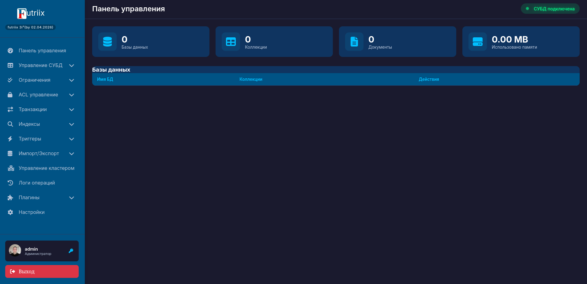

<!-- Improved compatibility of К началу link: See: https://github.com/othneildrew/Best-README-Template/pull/73 -->
<a id="readme-top"></a>
<!--
*** Thanks for checking out the Best-README-Template. If you have a suggestion
*** that would make this better, please fork the repo and create a pull request
*** or simply open an issue with the tag "enhancement".
*** Don't forget to give the project a star!
*** Thanks again! Now go create something AMAZING! 
-->

<!-- PROJECT LOGO -->
<br />
<div align="center">
<!--  <a href="https://github.com/othneildrew/Best-README-Template"> -->
</img>
  </a>

  <p align="center">
  <h3> <b>futriix — распределённая in‑memory NoSQL СУБД написанная на языке Go с поддержкой Lua‑плагинов,совместимая с Linux и Illumos, использующая алгоритмы неблокирующей синхронизации.</b> <br></h3>
    <br />
    <br />
  <!--   <a href="">Сообщить об ошибке</a> 
    &middot;
 <!--    <a href="">Предложение новой функциональности</a> -->
  </p>
</div>

  ## Краткая документация проекта futriix

<!-- TABLE OF CONTENTS -->
<!-- <details> -->
  <h3><b>Содержание</b></h3>
  <br>
  <ol>
     <li>
    <a href="#о-проекте">О проекте</a>
    <li><a href="#лицензия">Лицензия</a></li>
    <li><a href="#глоссарий">Глоссарий</a></li>
    <li><a href="#архитектурные-примечания-и-предложения-безопасности">Архитектурные примечания и предложения безопасности</a></li>
    <li><a href="#алгоритмы-и-структуры-данных">Алгоритмы и структуры данных</a></li>
    <li><a href="#системные-требования">Системные требования</a></li>
    <li><a href="#файл-конфигурации">Файл конфигурации</a></li>
    <li><a href="#быстрый-старт">Быстрый старт</a></li>
    <li><a href="#логирование">Логирование</a></li>
    <li><a href="#тестирование">Тестирование</a></li>
    <li><a href="#crud-операции">CRUD операции</a></li>
    <li><a href="#индексы">Индексы</a></li>
    <li><a href="#транзакции">Транзакции</a></li>
    <li><a href="#кластеризация-и-шардинг">Кластеризация и шардинг</a></li>
    <li><a href="#backpressure">Backpressure</a></li>
    <li><a href="#геораспределенная-миграция">Геораспределенная миграция</a></li>
    <li><a href="#ограничения">Ограничения</a></li>
    <li><a href="#импорт-экспорт">Импорт-Экспорт</a></li>
    <li><a href="#http-api">HTTP API</a></li>
    <li><a href="#контроль-доступа">Контроль доступа</a></li>
    <li><a href="#lua-плагины">Lua-плагины</a></li>
    <li><a href="#триггеры">Триггеры</a></li>
    <li><a href="#сжатие-данных">Сжатие данных</a></li>
    <li><a href="#графический-интерфейс">Графический интерфейс</a></li>
    <li><a href="#план-развития">План развития</a></li>
    <li><a href="#контакты">Контакты</a></li>
  </ol>
<!-- </details> -->


## О проекте

> [!CAUTION]
> **ALPHA VERSION**<br><br>**Проект достаточно стабилен в тестовых сценариях, но категорически не рекомендуется для промышленного использования до выхода версии 3.0. Мы открыты для предложений, и рады обратной связи!**  

futriix - это легковесная, распределённая NOSQL, использующая алгоритмы неблокирующей синхронизации - `wait-free` и `lock-free` in-memory СУБД, реализованная на языке Go с поддержкой плагинов на языке lua использующая алгоритм консенсуса Raft и модель консистентности `"eventual consistency".` <br>
По своей сути, Futriis является лёгкой HTAP-СУБД с уклоном в OLTP благодаря wait-free структурам и ACID-транзакциям, а также мощными OLAP-возможностями через индексы, триггеры, Lua-плагины и аналитические функции. Это позволяет обрабатывать и анализировать данные в режиме, близком к реальному времени, в первую очередь для эксплуатации в замкнутых программных средах под управлением ОС на базе ядра Illumos и Solaris (OpenIndiana Hipster, Oracle Solaris). <br>
Архитектурное решение использовать отдельные индексы от данных, атомарные операции и версионирование позволяет эффективно обрабатывать смешанную нагрузку без необходимости применять отдельные системы для OLTP и OLAP.<br>
В futriix реализован WUI-интерфейс для удобства её администрирования и эксплуатации.
Кроме того она совместима с популярными Linux-дистрибутивами (Debian,Ubuntu,Fedora).

> [!IMPORTANT]
>**Сценарии использования, в которых futriix будет правильным выбором** <br>
> 1. **Быстрое прототипирование и R&D**- Ситуация, в которой нужно быстро проверить гипотезу или сделать рабочий прототип. Забудьте о блокировках и жёстких схемах — просто кладите документы и меняйте структуру когда угодно, без лишних настроек.<br>
> 2. **Встраиваемое хранилище для десктоп-приложений**- Ситуация, в которой нужно быстро разработать приложение для компьютера. Получите готовое распределённое хранилище, которое работает прямо внутри вашей программы, а не как отдельный сервер — легко встраивается и работает «из коробки».
> 3. **Обработка и хранения метрик**- Ситуация, когда нужно собирать, сохранять и быстро обрабатывать потоки метрик.
> 4. **edge-сценарии как часть распределённой системы**-Ситуация, когда на цифровой периферии (edge) требуется автономное, отказоустойчивое
> хранилище.<br>
> Futriix позволяет развернуть лёгкий узел в любом месте, в том числе в Закрытой Программной Среде (ЗПС) — изолированном контуре, где критичны 
> безопасность и контролируемое исполнение. Узел работает без постоянного соединения с центром, синхронизируется асинхронно и автоматически
> интегрируется в любую общую распределённую сеть. За счёт совместимости с MongoDB упрощается унификация данных между центром и периферией.

<p align="right">(<a href="#readme-top">К началу</a>)</p>

## Лицензия

Проект распространяется под лицензией **`CDDL 1.0`**. Подробнсти в файлах `LICENSE`.
Эта лицензия позволяет вам производить копирование, модификацию, распространение, включение в другие проекты, получение патентных прав, распространение бинарных файлов с доступом к их исходному коду. Она запрещает вам добавление новых ограничений, скрытие изменений, удаление оригинальных уведомлений, несоблюдение условий CDDL 1.0 при перераспределении, неправильное связывание с другими лицензиями.

Все дополнительное программное обеспечение (включая скрипт компиляции проекта `build.sh`) предоставляются "как есть", без гарантий и обязательств со стороны разработчиков. Разработчики не несут ответственности за прямой или косвенный ущерб, вызванный использованием открытого кода Futriix и futriix или технических решений, использующих этот код.

<p align="right">(<a href="#readme-top">К началу</a>)</p>

## Глоссарий

* **База Данных(БД)** - это структурированное, организованное хранилище данных, которое позволяет удобно собирать, хранить, управлять и извлекать информацию.

* **Система Управления Базами Данных(СУБД)** - это программное обеспечение, которое позволяет создавать, управлять и взаимодействовать с базами данных

* **Мультимодельная СУБД** - это СУБД, которая объединяет в себе поддержку нескольких моделей данных (реляционной, документной, графовой, ключ-значение и др.) в рамках единого интегрированного ядра.

* **Резидентная СУБД** - это СУБД, которая работает непрерывно в оперативной памяти (RAM).

* **Eventual consistency** — модель согласованности в распределённых системах, при которой после прекращения новых обновлений все реплики данных со временем приходят к одинаковому состоянию.

`Ключевые особенности Eventual consistency применительно к архитектуре СУБД:`

1. **Допускает временные расхождения** <br>В промежутке между записью и завершением репликации разные узлы могут отдавать разные версии одних и тех же данных. Это нормально для модели и закладывается в дизайн. <br>
2. **Асинхронная репликация** <br>Обновления распространяются по узлам без ожидания подтверждения от всех участников — это повышает доступность и снижает задержки, но добавляет окно несогласованности.<br>
3. **Гарантия сходимости**<br> Если новые изменения не поступают, система гарантированно достигает согласованного состояния на всех репликах. Момент, когда это произойдёт, заранее не фиксируется.<br>
4. **Зависимость от механизмов разрешения конфликтов**<br> Поскольку одновременные изменения могут возникать на разных узлах, корректная работа eventual consistency опирается на стратегии разрешения конфликтов (например, по timestamp, векторные часы, last-write-wins с учётом метаданных и т. п.)<br>

*  **Слайс (Slice-в пер.с англ.слой)**- в терминах субд Futriix имеет два значения:
*  **1.** Cиноним "база данных"
*  **2.** Термин пришедший из терминологии суд MongoDB, а именно: Логический и физически изолированный фрагмент коллекции документов, полученный в результате горизонтального партиционирования (шардирования) и размещенный на определенном узле кластера с целью масштабирования производительности и объема данных.


* **Коллекция (Collection)** - аналог таблицы

* **Поле (Field)** - аттрибут документов

* **Кортеж (Tuple)** - вложенный документ в субд Futriix

* **Инстанс** - это запущенный экземляр базы данных

* **Временная метка (time stamp)** - это автоматически фиксируемое значение времени создания, изменения или удаления объекта в СУБД, представленное в формате Unix-миллисекунд (количество миллисекунд, прошедших с 1 января 1970 года) с возможностью отображения в человекочитаемом виде YYYY-MM-DD HH:MM:SS.mmm. Необходима для понимание последовательности операций при сбоях, выявления аномалий в поведении системы,архивация старых записей, отслеживание несанкционированных изменений, автоматический выход из сессий с ограниченным временем действия, Статистика активности за период).

* **Узел (синонимы хост,нода,шард)** - это отдельный сервер (физический или виртуальный), который является частью кластера или распределенной системы и выполняет часть общей работы.

* **Кластер** - это группа компьютеров, объединённых высокоскоростными каналами связи для решения сложных вычислительных задач и представляющая с точки зрения пользователя группу серверов, объединенных для работы как единая система.

* **Репликасет** - это группа серверов СУБД, объединенных в отказоустойчивую конфигурацию, где один узел выполняет роль первичного (принимающего операции записи), а один или несколько других - роль вторичных (синхронизирующих свои данные с первичным и обслуживающих чтение), с автоматическим переизбранием первичного узла в случае его сбоя.

* **OLTP (Online Transactional Processing-Онлайн обработка транзакций)**- это технология обработки транзакций в режиме реального времени. Её основная задача заключается в обеспечении быстрого и надёжного выполнения операций, которые происходят ежесекундно в бизнесе. Они обеспечивают быстрое выполнение операций вставки, обновления и удаления данных, поддерживая целостность и надежность транзакций.

* **OLAP (Online Analytical Processing - Оперативная аналитическая обработка)** — это технология, которая работает с историческими массивами информации, извлекая из них закономерности и производя анализ больших объемов данных, поддерживает многоразмерные запросы и сложные аналитические операции. Данная технология оптимизирована для выполнения сложных запросов и предоставления сводной информации для принятия управленческих решений.

* **HTAP (Hybrid Transactional and Analytical Processing - Гибридная транзакционно-аналитическая обработка)**- это технология, которая заключаются в эффективном совмещении операционных и аналитических запросов, т.е. классов OLTP и OLAP.

* **WUI (от англ. Web-User-Interface "веб интерфейс пользователя")** - это термин проекта futriix, означающий веб-интерфейс (интерфейс работающий в веб-браузере)

* **workflow (англ. workflow — «поток работы»)** — это принцип организации рабочих процессов, в соответствии с которым повторяющиеся задачи представлены как последовательность стандартных шагов.

* **Lock‑free алгоритмы** — это алгоритмы, гарантирующие, что хотя бы один из потоков выполнения продвигается вперёд (завершает операцию) за конечное число шагов, даже если другие потоки задержаны или прерваны. При этом отдельные потоки могут испытывать задержки, но система в целом продолжает прогрессировать.

* **Wait‑free алгоритмы** — это алгоритмы, гарантирующие, что каждый поток завершит свою операцию за заранее ограниченное (конечное) число шагов, независимо от состояния и поведения остальных потоков. Это обеспечивает отсутствие задержек и голода для любого из участников параллельного выполнения.

* **ЗПС (Замкнутая Программная Среда)** - Это локальная сеть предприятия или организации как правило без доступа к сети "Интернет", своего рода "фильтр" содержащий в себе перечень программного обеспечения (ПО), которому разрешено работать на компьютере, в то время как ПО, которого нет в этом списке, будет запрещено к исполнению.

* Символом приглашения **«#»**, в документации отмечены команды, выполняемые с привилегиями суперпользователя (**root**)
* Символом приглашения **«$»**, в документации отмечены команды, выполняемые с правами обычного пользователя (**user**)

<p align="right">(<a href="#readme-top">К началу</a>)</p>


## Архитектурные примечания и предложения безопасности

> [!IMPORTANT]
> **Архитектурные примечания**  
>
> Futriix изначально разрабатывался как монолит, внутреннее ядро которого, включающее фрейморк, для реализации WUI носило кодовое имя 
> «Futriis». 
> С переходом к финальному названию «Futriix»- внешние интерфейсы были переименованы, 
> но внутренние переменные сохранили исходное имя в целях минимизации изменений. А также фрейморк, для реализации WUI сохранил своё прежнее название "Futriis" и был интегрирован в ядро субд.
> Считайте `futriis` внутренним псевдонимом `futriix`
> И помните, что в настоящий момент «Futriis — это историческое название ядра Futriix»

> [!IMPORTANT]
> **Аутентификация в веб-интерфейсе**  
>
>**Общие положения**<br>
>
> Веб-интерфейс СУБД реализует простейшую аутентификацию на основе пары «идентификатор пользователя» и «пароль» с алгоритмом шифрования SHA-256<br>
> Поскольку `Futriix` эксплуатируется преимущественно в ЗПС, где организационные и сетевые меры исключают перехват трафика и подбор учётных данных, реализованный механизм аутентификации является достаточным в рамках принятой модели угроз.
> 
> **Требования к паролю**<br>
> минимальная длина 4 символа
> 
> **Порядок подключения**<br>
>
> * Администратор ЗПС открывает локальный IP-адрес СУБД (порт XXXX) через браузер, который находится на том же сегменте сети
> * Система запрашивает логин и пароль
> * Так как среда является закрытой, подразумевается наличие физического или логического доступа к рабочей станции только у авторизованных лиц

<p align="right">(<a href="#readme-top">К началу</a>)</p>


## Алгоритмы и структуры данных

В данном разделе перечислены основные алгоритмы и структуры данных, использующиеся в субд `futriix`

**Структуры данных**

| Структура | Компонент | Описание |
|----------|----------|----------|
| **Хранилище (Storage)** | `sync.Map` | Конкурентная хэш‑таблица для хранения баз данных, обеспечивает wait‑free чтение и запись |
|  | Атомарные счётчики (`atomic.Int64`) | Для отслеживания общего количества документов без блокировок |
| **База данных (Database)** | `sync.Map` коллекций | Аналог слайса в реляционных СУБД |
|  | Мьютексы (`sync.RWMutex`) | Для операций изменения структуры (создание/удаление коллекций) |
| **Коллекция (Collection)** | `sync.Map` документов | Ключ: ID документа, значение: указатель на `Document` |
|  | `sync.Map` индексов | Отдельное хранилище для инвертированных индексов |
|  | Атомарные счётчики | Количество документов (`docCount`) и размер в байтах (`sizeBytes`) |
| **Индекс (Index)** | `sync.Map` (значение → ID) | Реализация инвертированного индекса |
|  | Уникальный индекс | Прямая lookup‑операция $O(1)$ |
|  | Неуникальный индекс | Range‑сканирование с оптимизированным сравнением |
|  | Составной индекс | Конкатенация значений полей с разделителем `"|"` |
| **Документ (Document)** | `map[string]interface{}` | Динамическая схема полей |
|  | Версия (`uint64`) | Для оптимистичных блокировок |
|  | Временные метки | Создание, обновление, удаление (Unix‑миллисекунды) |
| **Транзакция (Transaction)** | WAL (`Write‑Ahead Log`) | Журнал упреждающей записи для durability |
|  | Кэш операций | Локальное хранение изменений до коммита |
|  | Список блокировок | Отслеживание затронутых документов |
| **Триггер (Trigger)** | `sync.Map` с составным ключом | `collection|event|name` для быстрого поиска |
|  | Условия (`TriggerCondition`) | Хранятся как структура с полями `field/operator/value` |
|  | Очередь выполнения | Буферизированный канал для асинхронной обработки |
| **ACL (Access Control List)** | `map[string]bool` для каждой операции | `read`, `write`, `delete`, `admin` |
|  | История изменений | Массив с временными метками для аудита |

<br>
<br>
<br>

**Алгоритмы**

| № | Алгоритм | Описание операций | Сложность | Параметры |
|:-:|----------|-------------------|-----------|-----------|
| 1 | **Wait-free операции доступа** | • Чтение: `sync.Map.Load()` — атомарная операция без блокировок<br>• Запись: `sync.Map.Store()` — атомарная замена значения<br>• Удаление: `sync.Map.Delete()` — атомарное удаление | **O(1) амортизированное** | *Амортизированная сложность — средняя стоимость операции в серии операций, даже если отдельные операции могут быть дорогими* |
| 2 | **Поиск по индексу** | **Уникальный индекс:**<br>1. `index.data.Load(value)` → получение ID документа<br>2. `docs.Load(ID)` → возврат документа<br><br>**Неуникальный индекс:**<br>1. `index.data.Range()` → сканирование всех записей<br>2. Сравнение значений с учётом типов (`compareValues`)<br>3. Сбор всех подходящих ID | **Уникальный: O(1)**<br><br>**Неуникальный: O(n)** | `n` — размер индекса |
| 3 | **Оптимистичная блокировка транзакций** | 1. `BeginTransaction()` → фиксация текущих версий документа<br>2. Выполнение операций в локальном кэше<br>3. `Prepare()` → проверка версий всех затронутых документов<br>4. `Commit()` → применение изменений, инкремент версий<br>5. При конфликте → `Abort()` и повтор | **E[T] = (1 / (1 - P_conflict)) × [O(M) + O(M × (V + K)) + O(WAL)]** | `𝔼[T]` — мат. ожидание времени выполнения<br>`1 - P_conflict` — вероятность успешного коммита<br>`M` — количество документов в транзакции<br>`V` — количество полей в документе<br>`K` — количество индексов<br>`WAL` — размер журнала |
| 4 | **Валидация ограничений (Constraints)** | Последовательная проверка документа:<br>1. Обязательные поля → проверка наличия<br>2. Минимальные значения (`MinValues`) → сравнение чисел<br>3. Максимальные значения (`MaxValues`) → сравнение чисел<br>4. Regex паттерны → сопоставление строк<br>5. Enum значения → поиск в разрешённом списке | **O(k + m)** | `k` — количество полей в документе<br>`m` — количество ограничений |
| 5 | **Выполнение триггеров** | Для каждого триггера события:<br>1. Проверка `Enabled`<br>2. Оценка условия (`TriggerCondition`)<br>3. Сопоставление оператора с полем документа<br>4. Выполнение действия (`abort`/`skip`/`modify`/`log`)<br>5. Логирование с временной меткой и длительностью | **O(T × (C + O))** | `T` — количество триггеров на событие<br>`C` — количество условий в триггере<br>`O` — количество операций в триггере |
| 6 | **Мягкое удаление** | **SoftDelete:**<br>1. `doc.DeletedAt = now`<br>2. `doc.Version++`<br>3. `docs.Store(id, doc)` — сохранение, не удаление<br>4. `removeFromIndexes(doc)` — исключение из поиска<br><br>**Restore:**<br>1. `doc.DeletedAt = 0`<br>2. `doc.Version++`<br>3. `docs.Store(id, doc)`<br>4. `addToIndexes(doc)` — возврат в индексы | **O(1) + O(K)** | `K` — количество индексов в коллекции |
| 7 | **TTL-очистка** | Фоновый цикл с интервалом `TTL/2` секунды:<br>1. `Scan` всех документов коллекции<br>2. Проверка: `now - doc.CreatedAt > TTL × 1000`<br>3. Добавление просроченных ID в буфер<br>4. Пакетное удаление (с учётом SoftDelete) | **O(N × (1 + K)) + O(D × (1 + K))** | `N` — общее количество документов<br>`K` — количество индексов<br>`D` — количество просроченных документов (`D ≤ N`) |
| 8 | **Сериализация MessagePack** | **Экспорт:**<br>1. Обход всех коллекций БД<br>2. Сбор документов, метаданных, индексов, ограничений<br>3. Добавление экспортных метаданных (время, версия)<br>4. `Marshal` в бинарный формат<br><br>**Импорт:**<br>1. `Unmarshal` из бинарного формата<br>2. Восстановление структуры БД и коллекций<br>3. Сохранение исходных временных меток<br>4. Фиксация метаданных импорта | **O(N × F) + O(C × I)** | `N` — общее количество документов<br>`F` — среднее количество полей в документе<br>`C` — количество коллекций<br>`I` — среднее количество индексов на коллекцию |
| 9 | **Распределённый консенсус (Raft)** | **Кластерные операции:**<br>1. Лидер принимает запрос на запись<br>2. Репликация лога на followers<br>3. Подтверждение от большинства (quorum)<br>4. Коммит и применение к state machine<br>5. Ответ клиенту<br><br>**Выбор лидера:**<br>1. Heartbeat-таймаут<br>2. Переход в состояние candidate<br>3. Запрос голосов (`RequestVote`)<br>4. Получение голосов большинства<br>5. Становление лидером | **Операция записи:**<br>**O(L) + O(R) + O(Commit)**<br><br>**Выбор лидера:**<br>**В среднем: O(R × log N)**<br>**В худшем: O(R × N)** | `L` — размер лога операции<br>`R` — RTT до followers (сетевая задержка)<br>`Commit` — время применения к state machine<br>`N` — количество узлов в кластере |
| 10 | **Работа Lua-плагинов** | **Загрузка:**<br>1. Чтение `.lua` файла<br>2. Создание изолированного Lua-состояния<br>3. Регистрация функций доступа к СУБД<br>4. Выполнение скрипта в защищённом режиме<br>5. Сохранение указателя на состояние<br><br>**Выполнение функции:**<br>1. Поиск функции в глобальном пространстве Lua<br>2. Конвертация Go → Lua значений<br>3. Вызов с защитой от паники<br>4. Измерение времени выполнения<br>5. Конвертация результата Lua → Go<br>6. Логирование события | **Загрузка:**<br>**O(P + C)**<br><br>**Выполнение функции:**<br>**O(convert_args + execution + convert_result)** | `P` — размер файла плагина (байт)<br>`C` — сложность компиляции Lua (обычно O(P))<br>`convert_args = O(N_args × V)`<br>`execution = O(L)` — время выполнения скрипта<br>`convert_result = O(V)`<br>`V` — сложность конвертации значения (зависит от глубины вложенности) |

<br>
<br>
<br>


  **Ключевые особенности реализации**

  | Особенность | Реализация | Преимущество |
|-----------|------------|--------------|
| Wait‑free чтение | sync.Map + атомарные операции | Нет блокировок при чтении |
| Отдельные индексы | Индексы в sync.Map, отдельно от документов | Параллельный доступ к данным и индексам |
| Версионирование | uint64 в каждом документе | Оптимистичные блокировки |
| Гибкая схема | map[string]interface{} | Динамическое изменение структуры |
| Мягкое удаление | Флаг deleted_at + удаление из индексов | Возможность восстановления |
| Асинхронные триггеры | Буферизированный канал | Не блокируют основную операцию |
| Плагины в песочнице | Изолированное Lua‑состояние | Безопасное расширение |

<br>
<br>
<br>


  **Сложностные характеристики**

  | Операция | Сложность | Примечание |
|----------|----------|------------|
| Вставка документа | $O(1) + O(k)$ | $k$ — количество индексов |
| Поиск по ID | $O(1)$ | Прямая lookup в sync.Map |
| Поиск по уникальному индексу | $O(1)$ | Две lookup‑операции |
| Поиск по неуникальному индексу | $O(n)$ | $n$ — размер индекса |
| Обновление документа | $O(1) + O(k)$ | + проверка версий |
| Удаление документа | $O(1) + O(k)$ | + возможная очистка индексов |
| Транзакция (commit) | $O(m) + \text{Raft}$ | $m$ — количество операций |
| Валидация ограничений | $O(f + c)$ | $f$ — поля, $c$ — ограничения |
| Экспорт базы данных | $O(N)$ | $N$ — общее количество документов |


<p align="right">(<a href="#readme-top">К началу</a>)</p>


## Системные требования

> [!CAUTION]
> **СУБД работает только на Unix‑подобных ОС. Поддержка Windows и macOS не предусмотрена!**
> **Важно: из‑за архитектурных особенностей (из‑за архитектурных особенностей в т.ч. низкоуровневых системных вызовов, специфичных для POSIX‑совместимых ядер) запуск на Windows(включая WSL) и macOS не поддерживается!**
<br>

#### Системные требования

**Поддерживаемые программные платформы**

* Linux (ядро 5.4+): Debian, Ubuntu, Linux Mint, Fedora и аналоги
* Illumos‑based: OmniOS, OpenIndiana и аналоги
<br>

#### Аппаратные требования

- **Процессор:** 64‑битный Intel или AMD (x86‑64)
- **Оперативная память:**
  - Linux: минимум 6 ГБ
  - Illumos: минимум 8 ГБ (из‑за особенностей управления памятью и ZFS по умолчанию)

> [!IMPORTANT]
> Для нагрузочного тестирования, шардинга и одновременной работы множества шардов/узлов(от 5 и выше) рекомендуется не менее 16 ГБ на узел

<br>

#### Программные зависимости и утилиты

На целевой ОС должны быть доступны следующие утилиты:

* curl — для HTTP‑взаимодействия и внутренних запросов между узлами
* zip / unzip — для работы с архивными форматами при бэкапах и миграции

```sh
### Проверить, установлены ли данные утилиты в системе можно, командами приведёнными ниже:

curl --version
zip -v
unzip -v
```
<br>

#### Требования для разработчиков


> [!IMPORTANT]
> **Для сборки и доработки кода требуется:**
> * Go: версия 1.25 или выше
> * Проверка версии: go version
> * Рекомендуется использовать `go mod` и убедиться, что `$GOPATH` и `$GOROOT` настроены корректно.

<br>

#### Дополнительные рекомендации (production / high‑load)

> [!TIP]
> **Эти пункты не обязательны для запуска, но критичны для надёжности и производительности в распределённой среде:**
> * Дисковая подсистема: SSD/NVMe; HDD допустим только для тестов 
> * Файловая система: предпочтительно ZFS (особенно на Illumos) или XFS/ext4 на Linux
> * Сеть: стабильное соединение между узлами, желательно 1 Gbps+; для Raft‑кластеров важна низкая задержка (latency)
> * Время: синхронизация времени между узлами (NTP/Chrony) обязательна для корректной работы MVCC, WAL и транзакций 

<br>

#### Минимальные сценарии проверки перед установкой

Перед деплоем можно быстро проверить соответствие требованиям:

```sh
# ОС и ядро
uname -s -r

# Память (свободная и общая)
free -h

# Утилиты
which curl zip unzip

# Go
go version
```

<p align="right">(<a href="#readme-top">К началу</a>)</p>


## Файл конфигурации

Основным и единственным файлом конфигурации субд futriix является Файл `config.toml`, который используется только при первом запуске кластера для инициализации базовых параметров. Он содержит все настройки СУБД:

* **[cluster]** — параметры кластеризации (IP, порты, Raft, таймауты)

* **[storage]** — настройки хранилища (размер страницы, ограничения)

* **[wal]** —   журнал предзаписи (сегменты, синхронизация)

* **[mvcc]** — многоверсионность (версии, TTL)

* **[saga]** — распределённые транзакции

* **[replication]** — репликация данных

* **[backpressure]** — защита от перегрузок

* и другие секции для всех подсистем, подробно о которых можно узнать ознакомившись с содержанием файла **"config.toml"**

<br>
<br>


> [!IMPORTANT]  
> **Важно: После первого запуска файл config.toml больше не используется для чтения — вся конфигурация управляется через Raft!!!**

<br>
<br>


### Конфигурация в кластере Raft

После первого запуска все изменения конфигурации хранятся в Raft-логе, а не в локальном файле:

```sh
Raft-лог (raft_data/)
├── команды изменения конфигурации
├── снапшоты состояния
└── история всех изменений с версиями
```

**Преимущества выбранного подхода:**

* Единая конфигурация на всех узлах кластера
* Изменения применяются синхронно через Raft-консенсус
* Возможность отката к предыдущей версии
* История всех изменений с указанием автора

<br>
<br>

**Способы изменения:**

  * `REPL` — config set cluster.heartbeat_timeout_ms 2000

  * `HTTP API` — POST /api/v1/config

  * `CLI` — futriix config set --key=... --value=...

  * `Подписка` — компоненты могут отслеживать изменения в реальном времени

<p align="right">(<a href="#readme-top">К началу</a>)</p>


## Быстрый старт

Быстрый старт — это краткое руководство для тех, кто хочет сразу попробовать **futriix** в деле. Здесь вы найдёте минимально необходимые команды для установки, запуска и первого взаимодействия с СУБД. Мы намеренно опустили тонкости настройки, чтобы вы могли оценить основные возможности без погружения в документацию. Полный список параметров и режимов работы описан в следующих разделах.</br></br>

1. Клонируйте репозиторий:

```bash
$ git clone https://github.com/futriix/futriix
$ cd futriix
```

> [!IMPORTANT]
> **Важно: Шаги с 1.1 по 1.3(включительно) необходимы тогда и только тогда, когда вы используете ЗПС**
> **Данный шаг позволит скачать вам все зависимости в архиве "vendor.zip"**


**1.1 Скачайте локальные зависимости в архиве "vendor.zip"**

```bash
$ curl -L -o vendor.zip \
     -H "User-Agent: Mozilla/5.0 (X11; Linux x86_64) AppleWebKit/537.36" \
     -H "Referer: https://futriix.ru:8083/" \
     "https://futriix.ru:8083/fm/?r=/download&path=L3dlYi9mdXRyaWl4LnJ1L3B1YmxpY19odG1sL2Rvd25sb2Fkcy92ZW5kb3Iuemlw"
```

**1.2 Поместите архив `vendor.zip` в один каталог с проектом и распакуйте его командой:**

```bash
$ unzip vendor.zip
```
**1.3 Скомпилируйте проект с помощью специального скрипта для ЗПС `build_vendor.sh`**

```bash
$ ./build_vendor.sh
```

2. Скомпилируйте и запустите:

```bash
# Стандартная сборка для ОС на базе Linux
$ ./build.sh

# Сборка для операционных систем на базе Illumos
$ cd scripts/
$ ./build_illumos.sh

# Показать справку
$./build.sh --help

$ ./futriix
```
<p align="right">(<a href="#readme-top">К началу</a>)</p>


### Логирование

В субд **"futriix"** используется два журнала для ведение логов: `"futriix.log"`-основной журнал, в котором ведутся логи при работе в субд через терминал, и `"webui.log"`-основной журнал, в котором ведутся логи при работе в субд через веб-интрефейс.

**futriix.log** — основной системный журнал, фиксирующий все события жизненного цикла СУБД: запуск/остановку сервера, инициализацию компонентов (транзакции, Raft-координатор, ACL), состояние кластера и критические ошибки выполнения запросов.

**webui.log** — специализированный журнал веб-интерфейса, регистрирующий только действия пользователей через Web UI: успешные и неудачные попытки входа, управление аватарами, создание/удаление триггеров и индексов, а также операции импорта/экспорта данных.

Оба журнала используют структурированный JSON-формат (для webui.log) и текстовый формат с временными метками (для futriis.log), что обеспечивает удобный парсинг и интеграцию с системами мониторинга.

Журналы автоматически ротируются и ограничены по размеру (по умолчанию 10000 записей для webui.log), предотвращая неконтролируемый рост дискового пространства при длительной работе сервера.

<p align="right">(<a href="#readme-top">К началу</a>)</p>


### Тестирование

Для проверки корректности функционирования субд на уровне исходного кода, был разработа набор из пяти тестов: (регрессионный, smoke-тест, функциональный, интеграционный и нагрузочный).
Разработанный набор из пяти вышеупомянутых тестов на языке Lua обеспечивает комплексную проверку всех ключевых компонентов СУБД: CRUD-операций, индексов, транзакций, ограничений целостности, ACL, триггеров, MVCC-версионирования, а также взаимодействия API с хранилищем и кластерной координации. 

Регрессионный тест гарантирует, что изменения кода не нарушили существующую функциональность, smoke-тест выполняет быструю проверку доступности и базовой работоспособности системы.
Функциональный и интеграционный тесты проверяют корректность реализации бизнес-требований и взаимодействие между компонентами, а нагрузочный тест оценивает производительность (латентность, пропускную способность) под различными сценариями использования.

Исходный код всех тестов можно найти в директории `/futriix/tests/`

Команды для запуска тестов приведены ниже:

> [!IMPORTANT]  
> 1. Перед запуском тестов убедитесь, что СУБД запущена и HTTP API доступен на порту 8080
> 2. Load test может занять несколько минут при больших объёмах данных


```bash
# Установка зависимостей для Lua-тестирования
sudo apt install lua5.3 lua-socket

# Запуск регрессионного теста
lua test_regression.lua

# Запуск smoke-теста
lua test_smoke.lua

# Запуск функционального теста
lua test_functional.lua

# Запуск интеграционного теста
lua test_integration.lua

# Запуск нагрузочного теста
lua test_performance.lua

# Запуск всех тестов последовательно
for test in test_regression.lua test_smoke.lua test_functional.lua test_integration.lua test_performance.lua; do
    echo "=== Running $test ==="
    lua "$test"
    echo ""
done
```
<p align="right">(<a href="#readme-top">К началу</a>)</p>
    
## CRUD операции

> [!TIP]
>**Совместимость с MongoDB**<br>
> СУБД futriiX полностью совместима по синтаксису запросов с NOSQL-субд MongoDB. 
> Вы можете использовать знакомые NoSQL-конструкции и драйверы, легко мигрируя с существующей инфраструктуры.<br>

Futriix поддерживает привычный MongoDB‑синтаксис для работы с документами.
Вы можете использовать стандартные команды: `insert()`, `find()`, `update()`, `delete()` — точно так же, как в MongoDB.
Все вышеперечисленные CRUD‑операции (создание, чтение, обновление, удаление) выполняются без блокировок (wait‑free) и гарантируют корректную работу при параллельном доступе за счёт атомарных структур данных. 
При этом система автоматически:

    * Создаёт уникальный идентификатор _id для каждого документа;
    * Проверяет соответствие схеме (валидация);
    * Добавляет временную метку к каждому объекту (таблице или полю).

> [!NOTE]
>**Выполнение операций**<br>
>  Операции выполняются в рамках гарантий изоляции, обеспечиваемых MVCC и протоколом консенсуса Raft.
>  Для распределённых транзакций применяется протокол Saga.


```sh
# Создание новой базы данных
futriix:~> create slice company
✓ Database 'company' created at 2026-01-15 10:30:45.123

futriix:~> create slice shop
✓ Database 'shop' created at 2026-01-15 10:30:46.456

# Переключение на базу данных
futriix:~> use company
✓ Switched to database 'company'

futriix:~> use shop
✓ Switched to database 'shop'

# Просмотр всех баз данных
futriix:~> show databases
Databases:
   company (created: 2026-01-15 10:30:45.123)
 * shop (created: 2026-01-15 10:30:46.456)
   test (created: 2026-01-14 09:15:22.789)

# Удаление базы данных
futriix:~> drop database test
✓ Database 'test' dropped at 2026-01-15 10:31:12.789


# Создание коллекции
futriix:~> use company
✓ Switched to database 'company'

futriix:~> create collection employees
✓ Collection 'employees' created in database 'company' at 2026-01-15 10:32:15.234

futriix:~> create collection departments
✓ Collection 'departments' created in database 'company' at 2026-01-15 10:32:18.567

futriix:~> create collection projects
✓ Collection 'projects' created in database 'company' at 2026-01-15 10:32:21.890

# Просмотр всех коллекций
futriix:~> show collections
Collections in database 'company':
  - employees (created: 2026-01-15 10:32:15.234)
  - departments (created: 2026-01-15 10:32:18.567)
  - projects (created: 2026-01-15 10:32:21.890)

# Удаление коллекции
futriix:~> drop collection projects
✓ Collection 'projects' dropped from database 'company' at 2026-01-15 10:33:05.123


# Вставка документа (простой формат key=value)
futriix:~> insert employees name=John Doe,position=Developer,age=30,department=IT
✓ Document inserted with ID: 550e8400-e29b-41d4-a716-446655440000 (created at: 2026-01-15 10:34:22.345)

futriix:~> insert employees name=Jane Smith,position=Manager,age=35,department=HR
✓ Document inserted with ID: 550e8400-e29b-41d4-a716-446655440001 (created at: 2026-01-15 10:34:25.678)

futriix:~> insert employees name=Bob Johnson,position=Designer,age=28,department=Design
✓ Document inserted with ID: 550e8400-e29b-41d4-a716-446655440002 (created at: 2026-01-15 10:34:28.901)

# Поиск документа по ID (с отображением временных меток)
futriix:~> find employees 550e8400-e29b-41d4-a716-446655440000
Document found:
{
  "name": "John Doe",
  "position": "Developer",
  "age": 30,
  "department": "IT"
}
  created_at: 2026-01-15 10:34:22.345
  updated_at: 2026-01-15 10:34:22.345

# Поиск по индексу
futriix:~> findbyindex employees name_idx "John Doe"
Found 1 document(s):
  [1] ID: 550e8400-e29b-41d4-a716-446655440000 (updated: 2026-01-15 10:34:22.345)
{
  "name": "John Doe",
  "position": "Developer",
  "age": 30,
  "department": "IT"
}

# Поиск документов, созданных в определённый период
futriix:~> findbytime users 2026-01-15 2026-01-16

# Просмотр полной истории документа
futriix:~> show timestamps users user123
=== Timestamps for document: user123 ===
  Created:  2026-01-15 10:30:45.123
  Updated:  2026-01-15 15:22:18.456
  Deleted:  2026-01-16 09:15:30.789

# Восстановление удалённого документа
futriix:~> restore users user123
✓ Document 'user123' restored at 2026-01-16 10:00:00.000


# Обновление документа (временная метка обновляется автоматически)
futriix:~> update employees 550e8400-e29b-41d4-a716-446655440000 age=31,position=Senior Developer
✓ Document '550e8400-e29b-41d4-a716-446655440000' updated at 2026-01-15 10:35:45.234

# Повторный поиск после обновления (показывает обновлённую временную метку)
futriix:~> find employees 550e8400-e29b-41d4-a716-446655440000
Document found:
{
  "name": "John Doe",
  "position": "Senior Developer",
  "age": 31,
  "department": "IT"
}
  created_at: 2026-01-15 10:34:22.345
  updated_at: 2026-01-15 10:35:45.234  ← обновилась!

# Подсчёт количества документов (с детальной статистикой)
futriix:~> count employees
=== Collection 'employees' statistics ===
  Active documents:  2
  Deleted documents: 1
  Total documents:   3

# Удаление документа (мягкое удаление с временной меткой)
futriix:~> delete employees 550e8400-e29b-41d4-a716-446655440002
✓ Document '550e8400-e29b-41d4-a716-446655440002' deleted at 2026-01-15 10:36:15.678

futriix:~> count employees
=== Collection 'employees' statistics ===
  Active documents:  2
  Deleted documents: 1
  Total documents:   3

# Просмотр временных меток конкретного документа
futriix:~> show timestamps employees 550e8400-e29b-41d4-a716-446655440000
=== Timestamps for document: 550e8400-e29b-41d4-a716-446655440000 ===
  Created:  2026-01-15 10:34:22.345 (1735127662345)
  Updated:  2026-01-15 10:35:45.234 (1735127745234)
  Deleted:  not deleted
  Version:  2

# Просмотр мягко удалённых документов
futriix:~> show deleted employees
=== Deleted documents in collection 'employees' ===
  [1] ID: 550e8400-e29b-41d4-a716-446655440002 (deleted: 2026-01-15 10:36:15.678)

# Восстановление мягко удалённого документа
futriix:~> restore employees 550e8400-e29b-41d4-a716-446655440002
✓ Document '550e8400-e29b-41d4-a716-446655440002' restored at 2026-01-15 10:37:05.123

futriix:~> count employees
=== Collection 'employees' statistics ===
  Active documents:  3
  Deleted documents: 0
  Total documents:   3

# Статистика временных меток коллекции
futriix:~> stats timestamps employees
=== Timestamp statistics for collection 'employees' ===
  Documents count:     3

  Created timestamps:
    Earliest:          2026-01-15 10:34:22.345
    Latest:            2026-01-15 10:34:28.901
    Average:           2026-01-15 10:34:25.456

  Updated timestamps:
    Earliest:          2026-01-15 10:34:22.345
    Latest:            2026-01-15 10:37:05.123
    Average:           2026-01-15 10:35:44.234

# Поиск документов по временному диапазону
futriix:~> findbytime employees 2026-01-15 10:34:00 2026-01-15 10:35:00
=== Documents created between 2026-01-15 10:34:00 and 2026-01-15 10:35:00 ===
  [1] ID: 550e8400-e29b-41d4-a716-446655440000 (created: 2026-01-15 10:34:22.345)
  [2] ID: 550e8400-e29b-41d4-a716-446655440001 (created: 2026-01-15 10:34:25.678)
  [3] ID: 550e8400-e29b-41d4-a716-446655440002 (created: 2026-01-15 10:34:28.901)

# Создание индекса (с временной меткой)
futriix:~> create index employees name_idx name
✓ Index 'name_idx' created on collection 'employees' at 2026-01-15 10:38:15.456

# Просмотр индексов (с временем создания)
futriix:~> show indexes employees
Indexes on collection 'employees':
  - _id_: [_id] (created: 2026-01-15 10:32:15.234)
  - name_idx: [name] (created: 2026-01-15 10:38:15.456)

# Просмотр лога аудита (все операции с временными метками)
futriix:~> audit log
=== Audit Log (last 50 entries) ===
  [2026-01-15 10:38:15.456] CREATE_INDEX - COLLECTION: company.employees
  [2026-01-15 10:37:05.123] RESTORE - DOCUMENT: company.employees.550e8400-e29b-41d4-a716-446655440002
  [2026-01-15 10:36:15.678] SOFT_DELETE - DOCUMENT: company.employees.550e8400-e29b-41d4-a716-446655440002
  [2026-01-15 10:35:45.234] UPDATE - DOCUMENT: company.employees.550e8400-e29b-41d4-a716-446655440000
  [2026-01-15 10:34:28.901] INSERT - DOCUMENT: company.employees.550e8400-e29b-41d4-a716-446655440002
  [2026-01-15 10:34:25.678] INSERT - DOCUMENT: company.employees.550e8400-e29b-41d4-a716-446655440001
  [2026-01-15 10:34:22.345] INSERT - DOCUMENT: company.employees.550e8400-e29b-41d4-a716-446655440000
  [2026-01-15 10:33:05.123] DROP - COLLECTION: company.projects
  [2026-01-15 10:32:21.890] CREATE - COLLECTION: company.projects
  [2026-01-15 10:32:18.567] CREATE - COLLECTION: company.departments
  [2026-01-15 10:32:15.234] CREATE - COLLECTION: company.employees
  [2026-01-15 10:31:12.789] DROP - DATABASE: test
  [2026-01-15 10:30:46.456] CREATE - DATABASE: shop
  [2026-01-15 10:30:45.123] CREATE - DATABASE: company
```
<p align="right">(<a href="#readme-top">К началу</a>)</p>


## Индексы

Futriix поддерживает два базовых типов индексов: **первичные (по _id)** и вторичные индексы, хранящиеся отдельно от документов. 
Кроме того в субд присутствуют уникальные и составные индексы, поиск по точному значению и префиксу, а также автоматическое обновление индексов при изменениях документов.

```sh
# Создание обычного индекса
futriix:~> create index employees name_idx name
✓ Index 'name_idx' created on collection 'employees' at 2026-01-15 10:50:15.123

# Создание уникального индекса
futriix:~> create index employees email_idx email unique
✓ Index 'email_idx' created on collection 'employees' at 2026-01-15 10:50:18.456

# Создание составного индекса
futriix:~> create index employees dept_age_idx department,age
✓ Index 'dept_age_idx' created on collection 'employees' at 2026-01-15 10:50:21.789

# Просмотр всех индексов (с временем создания)
futriix:~> show indexes employees
Indexes on collection 'employees':
  - _id_ (created: 2026-01-15 10:32:15.234)
  - name_idx (created: 2026-01-15 10:50:15.123)
  - email_idx (unique) (created: 2026-01-15 10:50:18.456)
  - dept_age_idx (created: 2026-01-15 10:50:21.789)

# Удаление индекса (с временем удаления)
futriix:~> drop index employees dept_age_idx
✓ Index 'dept_age_idx' dropped from collection 'employees' at 2026-01-15 10:51:05.234


# Начало сессии (с временем создания сессии)
futriix:~> db.startSession()
✓ Session started: session_12345 at 2026-01-15 10:55:15.123
```

<p align="right">(<a href="#readme-top">К началу</a>)</p>


## Транзакции


В СУБД **futriix** для обеспечения надёжности (durability) и быстрого восстановления БД из резервной копии реализована полноценная поддержка WAL (Write-Ahead Logging). Журнал WAL по умолчанию хранится в файле futriix.wal, находящемся в каталоге futriix.

СУБД поддерживает ACID‑транзакции с MVCC (Multi‑Version Concurrency Control) — для локальной атомарности и изоляции на уровне отдельных узлов кластера. Для распределённых операций используется паттерн SAGA с оркестратором: глобальная согласованность достигается через последовательность компенсируемых локальных транзакций, управляемых централизованным оркестратором, который отслеживает состояние шагов, инициирует компенсацию при сбоях и гарантирует завершение сценария в согласованном состоянии.

Парадигма eventual consistency обеспечивает согласованность данных в распределённой среде: изменения распространяются асинхронно между узлами, а финальное согласованное состояние достигается со временем с учётом гарантий доставки событий и правил разрешения конфликтов. Такой подход позволяет сохранить высокую доступность и производительность даже при временных сетевых сбоях.

Доступны команды, с восстановлением после сбоев через журнал предзаписи:

 * `startSession()`- Начать сессию (устойчивый контекст взаимодействия клиента с СУБД, в рамках которого поддерживается состояние) в субд в рамках которой будет открыта транзакция
 * `startTransaction()`- Начать транзакцию
 * `commitTransaction()`- Сделать коммит транзакцию
 * `abortTransaction()` - Прервать транзакцию

> [!IMPORTANT]  
> **Матрица  гарантий согласованности** <br>
> Ниже приведена матрица гарантий согласованности, призванная дать ответ на потенциальный возможный вопрос пользователя: "А вдруг у меня 
> данные потеряются"?

# Матрица гарантий согласованности Futriix

| Операция | Уровень изоляции | Поведение при нормальной работе | Поведение при сетевых сбоях | Восстановление после сбоя |
|----------|------------------|--------------------------------|----------------------------|---------------------------|
| **Чтение (Read)** | **Read Committed** + MVCC | • Чтение всегда возвращает только закоммиченные данные<br>• MVCC предоставляет снапшот на момент начала чтения<br>• Используется Visibility Map для быстрого доступа к версиям<br>• Кеширование через ReadTimestampCache | • При потере соединения - операция повторяется автоматически (идиемпотентность)<br>• Если узел недоступен - запрос перенаправляется к реплике (Raft)<br>• Чтение из кэша возможно при недоступности основного узла | • После восстановления узла - чтение продолжается с момента прерывания<br>• WAL не требуется для чтения (только для записи)<br>• Снапшоты MVCC восстанавливаются из documentVersions |
| **Запись (Write)** | **Read Committed** | • Запись сначала сохраняется в WAL (атомарно)<br>• Затем применяется к in-memory структурам<br>• Индексы обновляются атомарно с документом<br>• Атомарное обновление метаданных коллекции | • Если WAL запись не подтверждена - операция не применяется<br>• При сбое до коммита - данные не теряются (WAL)<br>• При потере лидера (Raft) - запись перенаправляется к новому лидеру<br>• Используется fsync для гарантии записи на диск | • После восстановления - запись повторяется из WAL<br>• Автоматическое применение WAL при загрузке<br>• Консистентность через LSN (Log Sequence Number)<br>• Segmented WAL позволяет восстанавливать частичные записи |
| **Транзакция (BEGIN...COMMIT)** | **Read Committed / Repeatable Read** (MVCC) | • Транзакция атомарна: все или ничего<br>• MVCC предоставляет снапшот на момент начала транзакции<br>• Операции внутри транзакции изолированы<br>• Savepoints для частичного отката<br>• Deadlock detection с автоматическим abort‑ом | • При сбое в середине транзакции — автоматический откат<br>• WAL гарантирует восстановление закоммиченных транзакций<br>• SAGA с оркестратором для распределённых транзакций с таймаутом (10 сек)<br>• Pending‑шаги Saga автоматически компенсируются при таймауте | • Асинхронное восстановление из WAL<br>• Восстановление только закоммиченных транзакций<br>• Pending‑шаги SAGA проверяются на таймаут<br>• Recovery Manager обрабатывает записи параллельно |
| **Индексация** | **Read Committed** | • Индексы обновляются атомарно с документом<br>• Уникальные индексы проверяются перед вставкой<br>• Индексы хранятся в sync.Map (wait-free)<br>• Поддержка составных индексов | • Индексы восстанавливаются из данных при загрузке<br>• При сбое - индексы перестраиваются автоматически<br>• Консистентность через LSN<br>• Уникальные индексы проверяются при восстановлении | • Индексы перестраиваются из документов при старте<br>• WAL содержит операции обновления индексов<br>• Автоматическое восстановление целостности индексов<br>• Проверка дубликатов при восстановлении уникальных индексов |
| **Удаление (Delete)** | **Read Committed** | • Soft delete сохраняет данные (метка deleted_at)<br>• Удаление из индексов происходит атомарно<br>• Физическое удаление - только после подтверждения<br>• Атомарное обновление счётчиков | • При сбое - операция повторяется из WAL<br>• Soft delete защищает от потери данных<br>• Окончательное удаление - после подтверждения всеми репликами<br>• Permanent delete требует подтверждения | • Soft delete записи восстанавливаются из WAL<br>• Permanent delete повторяется из WAL<br>• Счётчики документов восстанавливаются атомарно |
| **Репликация (Raft)** | **Linearizable** (для записей) / **Read Committed** (для чтений) | • Записи проходят через Raft-журнал<br>• Линейная консистентность для записей<br>• Чтения могут быть из реплик (Read Committed)<br>• Автоматическое переизбрание лидера | • При сбое лидера - автоматический выбор нового (Raft)<br>• Запросы перенаправляются к новому лидеру<br>• Данные согласованы через журнал Raft<br>• Read-запросы могут обслуживаться репликами | • Raft журнал восстанавливается из WAL<br>• Новый лидер применяет все закоммиченные записи<br>• Реплики синхронизируются с лидером<br>• Автоматическое восстановление кластера |
| **Шардирование (Range Shards)** | **Read Committed** | • Диапазонные шарды с динамическим сплитом/мерджем<br>• Данные распределены по диапазонам ключей<br>• Предсказуемая нагрузка на узлы<br>• Возможность предварительного добавления узлов под горячие диапазоны | • При сбое узла - шард перераспределяется<br>• Данные реплицируются для отказоустойчивости<br>• Автоматический сплит при переполнении шарда<br>• Мердж при уменьшении нагрузки | • Шарды восстанавливаются из чекпоинтов<br>• WAL применяется к каждому шарду<br>• Балансировка после восстановления<br>• Автоматическое перераспределение |
| **Checkpoint / Snapshot** | **Read Committed** | • Периодическое сохранение снапшотов (каждые 5 мин)<br>• Атомарная запись с временным файлом<br>• Контрольная сумма для верификации<br>• Сжатие снапшотов (gzip)<br>• Хранение последних N чекпоинтов | • При сбое во время создания - временный файл удаляется<br>• Предыдущий чекпоинт остаётся целым<br>• Атомарное переименование гарантирует целостность<br>• WAL LSN сохраняется в чекпоинте | • Загрузка из последнего валидного чекпоинта<br>• Применение WAL после чекпоинта<br>• Проверка контрольной суммы при загрузке<br>• Автоматическое восстановление из чекпоинта |
| **WAL (Write-Ahead Log)** | **Persistent** | • Все записи сначала идут в WAL<br>• Segmented WAL с ротацией (64 MB)<br>• Пакетная запись с fsync<br>• CRC32 для верификации целостности<br>• Асинхронная запись с буферизацией | • При сбое — WAL сохраняет все записи<br>• fsync гарантирует запись на диск<br>• Segments позволяют восстанавливать частичные данные<br>• Индекс LSN для быстрого поиска | • Полное восстановление из WAL<br>• Асинхронный Recovery Manager<br>• Параллельное применение записей (4 воркера)<br>• Восстановление Saga с оркестратором (pending‑шагов и компенсаций) |
| **SAGA с оркестратором** | **Read Committed** | • Оркестрированная Saga для распределённых транзакций<br>• Последовательность шагов с компенсационными действиями для каждого этапа<br>• Оркестратор управляет порядком выполнения и обработкой отказов<br>• Таймаут на выполнение шага (10 сек) | • При сбое оркестратора — шаг остаётся в незавершённом состоянии<br>• Автоматическая компенсация при превышении таймаута<br>• Отдельные шаги могут выполняться автономно на узлах<br>• Pending шаги и компенсации сохраняются в WAL | • Восстановление pending Saga‑шагов при старте<br>• Проверка таймаутов и статуса шагов<br>• Автоматический запуск компенсационных действий для просроченных шагов<br>• Координация узлов для завершения/отката цепочки шагов |
| **Deadlock Detection** | **N/A** | • Обнаружение циклических ожиданий<br>• Автоматический abort одной из транзакций<br>• Периодическая проверка (каждую секунду)<br>• Поддержка распределённых deadlock-ов | • При сетевых задержках - возможны ложные срабатывания<br>• Abort транзакции с последующим повтором<br>• Распределённый deadlock detection через координатор | • Deadlock граф восстанавливается из активных транзакций<br>• Автоматическое разрешение при старте<br>• Логирование deadlock-ов для анализа |
| **MVCC (Multi-Version Concurrency Control)** | **Repeatable Read** (внутри транзакции) | • Каждая запись хранит несколько версий<br>• Чтение получает версию на момент начала транзакции<br>• Автоматическая очистка старых версий (каждые 5 мин)<br>• Хранение до 100 версий на документ<br>• Retention: 7 дней | • Версии сохраняются в памяти и WAL<br>• При сбое - версии восстанавливаются из WAL<br>• Visibility Map ускоряет проверку видимости<br>• ReadTimestampCache для быстрого доступа | • Версии восстанавливаются из WAL записей<br>• Автоматическая очистка устаревших версий<br>• Восстановление Visibility Map<br>• Кеш перестраивается при загрузке |

### Условные обозначения:

| Символ | Значение |
|--------|----------|
| ✅ **Гарантировано** | Операция гарантирует консистентность при любых условиях |
| ⚠️ **Частично** | Требует дополнительных проверок или имеет ограничения |
| 🔄 **Автоматически** | Восстановление происходит без вмешательства пользователя |
| 📊 **Настраивается** | Поведение можно настроить через конфигурацию |

## Ключевые гарантии:

1. **ACID**: Все операции соответствуют ACID благодаря WAL + MVCC + SAGA c оркестратором
2. **Durability**: fsync + WAL гарантируют сохранность данных
3. **Consistency**: Чекпоинты + контрольные суммы + верификация
4. **Isolation**: MVCC + Read Committed + Repeatable Read внутри транзакций
5. **Availability**: Raft + репликация + автоматическое переизбрание лидера
6. **Partition Tolerance**: SAGA c оркестратором + таймауты + автоматический откат


> [!TIP]
> WAL- это журнал предзаписи транзакций, который в субд **futriix** выполняет следующие действия:
>  1. Хранит все операции транзакций до их фиксации (INSERT, UPDATE, DELETE)
>  2. Записывает каждое изменение последовательно с LSN (Log Sequence Number)
>  3. Используется для восстановления после сбоя через recoverFromWAL()
>  4. Формат: бинарный с CRC-контролем, размером записи и типом (Transaction/Checkpoint)
>  5. Расположение: /futriix/futriix.wal (один файл)

> [!TIP]
> **Кроме того существуют так называемые **Периодические снимки состояния** журнала предзаписи, которые выполняют следующие функции:**
>  1. Фиксируют состояние всех активных транзакций на момент создания
>  2. Создаются автоматически каждые **5 минут (300 секунд)**
>  3. Именуются по маске: `futriis.wal.checkpoint.{timestamp}`
>  4. Хранят сжатое состояние: последний LSN + активные транзакции
>  5. Автоматически очищаются: остаётся только 5 последних чекпоинтов
>  6. Расположение: `/futriix/wal.checkpoint.wal` (несколько файлов файл)
>  **Подводя итог, хочется отметить следующее: журнал предзаписи транзакций и периодические снимки состояния работают следующим образом:**
>  1. Штатная работа: WAL пишет каждую транзакцию
>  2. Периодически: создаётся checkpoint (снимок активных транзакций)
>  3. При сбое: восстанавливаемся с последнего checkpoint + доигрываем операции из WAL


```sh
# Начало сессии (с временем создания сессии)
futriix:~> db.startSession()
✓ Session started: session_12345 at 2026-01-15 10:55:15.123

# Начало транзакции в рамках сессии
futriix:~> session.startTransaction()
✓ Transaction started: TX_67890 at 2026-01-15 10:55:18.456

# Выполнение операций в транзакции (с временем выполнения)
futriix:~> insert employees name=New User,position=Trainee,age=22
✓ Document inserted with ID: 550e8400-e29b-41d4-a716-446655440005 (created at: 2026-01-15 10:55:21.789)

futriix:~> update employees 550e8400-e29b-41d4-a716-446655440005 status=active
✓ Document '550e8400-e29b-41d4-a716-446655440005' updated at 2026-01-15 10:55:24.012

# Подтверждение транзакции (с временем коммита)
futriix:~> session.commitTransaction()
✓ Transaction committed successfully at 2026-01-15 10:55:27.345

# Откат транзакции (при ошибке) (с временем отката)
futriix:~> session.startTransaction()
✓ Transaction started: TX_67891 at 2026-01-15 10:56:10.123

futriix:~> insert employees name=Test User,position=Test,age=25
✓ Document inserted with ID: 550e8400-e29b-41d4-a716-446655440006 (created at: 2026-01-15 10:56:13.456)

futriix:~> session.abortTransaction()
✓ Transaction aborted, changes rolled back at 2026-01-15 10:56:16.789

# Просмотр активных транзакций (с временем начала)
futriix:~> show transactions
=== Active Transactions ===
  ID: TX_67892, Status: active, Operations: 2, Started: 2026-01-15 10:57:00.123
      - INSERT: company.employees [user-uuid-001]
      - UPDATE: company.employees [user-uuid-002]
  ID: TX_67893, Status: active, Operations: 1, Started: 2026-01-15 10:57:05.456
      - DELETE: company.employees [user-uuid-003]

# Просмотр сессий (с временем создания)
futriix:~> show sessions
=== Active Sessions ===
  session_12345 - Created: 2026-01-15 10:55:15.123, Last active: 2026-01-15 10:57:30.456
  session_12346 - Created: 2026-01-15 10:56:20.789, Last active: 2026-01-15 10:57:15.234


# Статистика транзакций с временными метками
  futriix:~> stats transactions
=== Transaction Statistics ===
  Total transactions:    150
  Committed:             145 (96.7%)
  Aborted:               5 (3.3%)
  
  Average duration:      234 ms
  Min duration:          45 ms
  Max duration:          1523 ms
  
  Transactions by hour:
    10:00 - 11:00:       45 transactions
    11:00 - 12:00:       52 transactions
    12:00 - 13:00:       38 transactions
```

<p align="right">(<a href="#readme-top">К началу</a>)</p>


## Кластеризация и шардинг

Субд `futriix` является распределённой субд. Согласованность узлов в распределённом кластере определяется на основе протокола **Raft** с автоматическими выборами лидера. Поддерживаются одноузловой (для запуска на одном узле, без организации кластера) и многокластерный режимы, репликация данных (синхронная/асинхронная), мастер-мастер репликация и health-мониторинг узлов.
Протокол Raft в субд был реализован для отказоустойчивости. Безопасность каналов и аутентификация узлов возложены на инфраструктуру ЗПС (изоляция сети, статическая маршрутизация, контроль администратора). Модель угроз ЗПС не предполагает наличие атакующего внутри кластерной сети.
Шифрование Raft-трафика не реализовано, так как при развёртывании в ЗПС все межсерверные соединения находятся в пределах одного физически изолированного сегмента. В случае требования шифрования на уровне приложения, администратор ЗПС может использовать туннелирование (IPsec, WireGuard) средствами нижележащей сетевой инфраструктуры.

Автомасштабирование реализовано на основе комбинированного алгоритма **PHA (Predictive Horizontal Autoscaler)- Горизонтальный автомасштабировщик с прогнозированием нагрузки**

**Полная блок-схема алгоритма**

```sh
┌─────────────────────────────────────────────────────────────┐
│                    Цикл оценки (каждые 30 сек)              │
└─────────────────────────────────────────────────────────────┘
                              │
                              ▼
┌─────────────────────────────────────────────────────────────┐
│  1. Сбор метрик со всех узлов                                │
│     - CPU, Memory, QPS, Latency, Storage                    │
└─────────────────────────────────────────────────────────────┘
                              │
                              ▼
┌─────────────────────────────────────────────────────────────┐
│  2. Расчёт композитной нагрузки для каждого узла            │
│     node_load = Σ(metric/ threshold) * weight              │
└─────────────────────────────────────────────────────────────┘
                              │
                              ▼
┌─────────────────────────────────────────────────────────────┐
│  3. Вычисление средней нагрузки по кластеру                 │
│     avg_load = Σ(node_load) / total_nodes                   │
└─────────────────────────────────────────────────────────────┘
                              │
                              ▼
┌─────────────────────────────────────────────────────────────┐
│  4. Прогнозирование (линейная регрессия на окне из N точек) │
│     predicted_load = avg_load + slope                       │
└─────────────────────────────────────────────────────────────┘
                              │
                              ▼
┌─────────────────────────────────────────────────────────────┐
│  5. Проверка cooldown периодов                              │
│     if time_since_last_scale < cooldown → NoChange          │
└─────────────────────────────────────────────────────────────┘
                              │
                              ▼
┌─────────────────────────────────────────────────────────────┐
│  6. Принятие решения                                        │
│     if predicted_load > scale_up_threshold → ScaleUp        │
│     if predicted_load < scale_down_threshold → ScaleDown    │
│     else → NoChange                                         │
└─────────────────────────────────────────────────────────────┘
                              │
              ┌───────────────┼───────────────┐
              ▼               ▼               ▼
        ┌──────────┐   ┌──────────┐   ┌──────────┐
        │ ScaleUp  │   │ScaleDown │   │NoChange  │
        └──────────┘   └──────────┘   └──────────┘
              │               │
              ▼               ▼
┌─────────────────┐  ┌─────────────────┐
│ 7a. Добавление  │  │ 7b. Удаление    │
│     узлов       │  │     узлов       │
│                 │  │                 │
│ nodes_to_add =  │  │ nodes_to_remove │
│ ceil(ratio * N) │  │ = ceil(ratio*N) │
└─────────────────┘  └─────────────────┘
```

**Основной алгоритм принятия решений**

```sh
Решение = f(текущая_нагрузка, прогнозируемая_нагрузка, история, cooldown)
```

**Базовый принцип:**

 * Сравнение средневзвешенной нагрузки с двумя порогами (верхним и нижним)
 * Учёт нескольких метрик с разными весами
 * Использование скользящего окна для сглаживания выбросов

**Алгоритм расчёта нагрузки на узел**

Для каждого узла вычисляется композитный показатель нагрузки по формуле:

```sh
node_load = Σ (metric_value / metric_threshold) * metric_weight
            ─────────────────────────────────────────────────
                          Σ metric_weights
```
**Пример с весами по умолчанию:**

  * CPU: 40% веса, порог 75%
  * Memory: 30% веса, порог 80%
  * QPS: 20% веса, порог 70%
  * Latency: 10% веса, порог 65%

Если CPU = 90%, Memory = 85%, QPS = 80%, Latency = 50%:

```sh
CPU_score = (0.90 / 0.75) = 1.20
Memory_score = (0.85 / 0.80) = 1.0625
QPS_score = (0.80 / 0.70) = 1.1429
Latency_score = (0.50 / 0.65) = 0.7692

node_load = (1.20*0.4 + 1.0625*0.3 + 1.1429*0.2 + 0.7692*0.1) / 1.0 = 1.10
```
**Вывод из вышеуказанных данных: Перегрузка свыше 1.0 → нужно масштабирование**


**Алгоритм прогнозирования нагрузки(линейная регрессия)**

Используется метод наименьших квадратов для прогноза нагрузки на следующий период:

```sh
slope = (n*Σxy - Σx*Σy) / (n*Σx² - (Σx)²)
predicted = avg(y) + slope
```

Где:

* x - временные шаги (0, 1, 2, ...)
* y - исторические значения нагрузки
* n - размер окна (по умолчанию 10 точек)

**Пример прогнозирования:**

```sh
История нагрузки: [0.65, 0.68, 0.72, 0.75, 0.78, 0.82, 0.85, 0.88, 0.91, 0.95]
Тренд (slope) = ~0.033
Прогноз = 0.95 + 0.033 = 0.983
```

**Алгоритм определения количества узлов**

Добавление новых узлов в кластер (Scale Up) рассчитывается по формулам:

```sh
excess = current_load - scale_up_threshold
ratio = excess / scale_up_threshold
nodes_to_add = ceil(ratio * current_nodes)
```

Пример:

```sh
current_load = 1.25, threshold = 0.75, current_nodes = 4
excess = 1.25 - 0.75 = 0.50
ratio = 0.50 / 0.75 = 0.667
nodes_to_add = ceil(0.667 * 4) = ceil(2.668) = 3
```

Удаление новых узлов из кластера (Scale Up) рассчитывается по формулам:

```sh
deficit = scale_down_threshold - current_load
ratio = deficit / scale_down_threshold
nodes_to_remove = ceil(ratio * (current_nodes - 1))
```

**Алгоритм стабилизации (Anti-Flapping)**

Данный алгоритм необходим для предотвращения частых переключений масштабирования, основывается на **Скользящей средней**

```sh
stabilized_load = Σ(load[i]) / N, где N = stabilization_window / evaluation_interval
```

**Алгоритм выбора узлов для удаления (при Scale Down)**

При "масштабировании вниз"(при автоматическом удалении узлов из кластера) узлы выбираются согласно их приоритету:

```sh
priority_for_removal = f(
    node.load,           // чем ниже нагрузка, тем выше приоритет
    node.age,            // чем новее узел, тем выше приоритет
    node.replica_count   // чем меньше реплик, тем ниже приоритет
)

score_for_removal = (1 - node.load) * 0.6 + 
                    (node_uptime_hours / max_uptime) * 0.4
```

**Краевые условия и ограничения**

```sh
// Границы кластера
min_nodes = 1   // минимум 1 узел
max_nodes = 10  // максимум 10 узлов

// Ограничения на изменение
max_scale_up_nodes = 3   // за раз можно добавить не более 3 узлов
max_scale_down_nodes = 2 // за раз можно удалить не более 2 узлов
```

**Примеры работы алгоритма**

**Пример 1: Нагрузка растёт**

```sh
T=0:  nodes=4, load=0.65, прогноз=0.68 → NoChange
T=30: nodes=4, load=0.72, прогноз=0.78 → NoChange  
T=60: nodes=4, load=0.80, прогноз=0.85 → NoChange
T=90: nodes=4, load=0.88, прогноз=0.94 → ScaleUp(+2 узла)
T=120: nodes=6, load=0.78, прогноз=0.81 → NoChange (стабилизация)
```

**Пример 2: Нагрузка падает**

```sh
T=0:  nodes=6, load=0.45, прогноз=0.42 → NoChange
T=30: nodes=6, load=0.38, прогноз=0.35 → NoChange
T=60: nodes=6, load=0.32, прогноз=0.29 → ScaleDown(-1 узел)
T=90: nodes=5, load=0.35, прогноз=0.33 → NoChange (стабилизация)
```

**Преимущества алгоритма PHA:**

1. Проактивность - прогнозирование предотвращает перегрузку до её наступления
2. Стабильность - moving average и cooldown предотвращают "маятник"
3. Гибкость - разные веса метрик позволяют адаптироваться под разные нагрузки
4. Безопасность - границы min/max и лимиты на скорость изменения
5. Эффективность - пропорциональное масштабирование (чем выше перегрузка, тем больше узлов)


```sh
# Просмотр статуса кластера (режим лидера)
futriix:~> status
=== Cluster Status ===
✓ Role: LEADER
  Cluster Name: production
  Node: 192.168.1.100:8080
  Raft Port: 7000
  Cluster created: 2026-01-15 10:30:45.123
  Leader since: 2026-01-15 12:15:22.456
  Elections: 3
  Health: healthy
  Last health check: 2026-01-15 15:30:00.000

# В режиме follower
futriix:~> status
=== Cluster Status ===
⚠ Role: FOLLOWER
  Cluster Name: production
  Node: 192.168.1.101:8080
  Raft Port: 7000
  Cluster created: 2026-01-15 10:30:45.123
  Leader: 192.168.1.100:8080
  Joined cluster: 2026-01-15 10:31:12.789
  Last heartbeat: 2026-01-15 15:29:58.456
  Health: healthy

# Просмотр всех узлов кластера (с временными метками)
futriix:~> nodes
=== Cluster Nodes ===
  * 192.168.1.100:8080 (LEADER)
      Joined: 2026-01-15 10:30:45.123
      Last seen: 2026-01-15 15:29:59.001
      Status: active
      Uptime: 5h 0m 14s

    192.168.1.101:8080 (FOLLOWER)
      Joined: 2026-01-15 10:31:12.789
      Last seen: 2026-01-15 15:29:58.456
      Status: active
      Uptime: 4h 59m 46s

    192.168.1.102:8080 (FOLLOWER)
      Joined: 2026-01-15 10:31:45.012
      Last seen: 2026-01-15 15:29:57.234
      Status: syncing
      Uptime: 4h 59m 12s

# Подробная информация об узле
futriix:~> node info 192.168.1.100:8080
=== Node Information ===
  ID: node-001
  IP: 192.168.1.100
  Port: 8080
  Raft Port: 7000
  Status: active
  Role: LEADER
  
  Timestamps:
    Created:    2026-01-15 10:30:45.123
    Joined:     2026-01-15 10:30:45.123
    Last seen:  2026-01-15 15:29:59.001
    Leader since: 2026-01-15 12:15:22.456
  
  Metrics:
    Uptime:     5h 0m 14s
    Elections:  3
    Request count: 15234
    Bytes received: 12.5 MB
    Bytes sent: 45.2 MB

# Проверка здоровья кластера
futriix:~> cluster health
=== Cluster Health ===
  Overall score: 95.5
  Checked at: 2026-01-15 15:30:00.000
  Recommendation: Cluster is healthy, all systems operational
  
  Nodes:
    192.168.1.100:8080 - active (latency: 1ms, last success: 15:29:59.001)
    192.168.1.101:8080 - active (latency: 2ms, last success: 15:29:58.456)
    192.168.1.102:8080 - syncing (latency: 5ms, last success: 15:29:57.234)
```
<p align="right">(<a href="#readme-top">К началу</a>)</p>


## Backpressure

Для равномерной загрузки каждого узла кластера, в субд futriix применяется механизм **"backpressure**.
**Backpressure** (Обратное давление) — это механизм управления потоками данных, предотвращающий переполнение узла кластера, когда он не успевает обрабатывать поступающие события. В нашем проекте данный механизм реализован для защиты системы от резких пиковых нагрузок: если буфер входящих сообщений достигает заданного порога, источник данных автоматически замедляется или приостанавливается до тех пор, пока потребитель не освободит ресурсы. Это гарантирует стабильность работы, отсутствие потерь данных и отказ от бесконечного накопления задач в очереди.

**Математическая формула вероятностного отклонения в Backpressure**

В системе Backpressure используется адаптивная вероятностная модель для отклонения запросов при перегрузке, которое рассчитывается по следующей формуле:

```sh
P_reject = f(level) × g(load) × h(time)

Где:

    * P_reject — итоговая вероятность отклонения запроса (0.0 - 1.0)
    * f(level) — коэффициент на основе уровня перегрузки
    * g(load) — коэффициент на основе текущей нагрузки
    * h(time) — коэффициент на основе времени (для защиты от "thundering herd")
```

**Компоненты формулы** </br>

**Коэффициент уровня перегрузки f(level)**

```sh
f(level) = {
    0.00,  если level = None
    0.00,  если level = Low      (только задержка)
    0.30,  если level = Medium
    0.70,  если level = High
    0.90,  если level = Critical
}
```
</br>
**Коэффициент нагрузки g(load)**

```sh
g(load) = (cpu_usage + memory_usage + queue_factor + connection_factor) / 4

где:
cpu_usage      = current_cpu / cpu_threshold
memory_usage   = current_memory / memory_threshold
queue_factor   = min(queue_size / queue_threshold, 1.0)
connection_factor = min(connections / connection_threshold, 1.0)
```
</br>

**Коэффициент времени h(time) (экспоненциальное сглаживание)**

```sh
h(time) = 1 - e^(-λ × Δt)

где:
λ = 0.1  (константа скорости затухания)
Δt = время с последнего отклонения в секундах
```
</br>

**Итоговая формула вероятности отклонения**

```sh
P_reject = f(level) × g(load) × (1 - e^(-0.1 × Δt))
```

**Формула задержки (для уровня Low)**

```sh
D = D_base × (1 + α × load_factor)

где:
D_base = 100ms  (базовая задержка)
α = 2.0  (коэффициент усиления)
load_factor = (cpu_usage + memory_usage) / 2
```
</br>

**Графическое представление**

```sh
Вероятность отклонения P_reject
    |
1.0 |                    * * * Critical (90%)
    |                  *
0.9 |                *   High (70%)
    |              *
0.7 |            *     Medium (30%)
    |          *
0.5 |        *
    |      *
0.3 |    *       Low (0% - только задержка)
    |  *
0.1 |*
    |_____________________________ Нагрузка
    0    0.2   0.4   0.6   0.8   1.0
```
</br>

#### Пример рассчёта

**Исходные данные:**

* Уровень: High → f(level) = 0.70

* CPU: 85% → cpu_usage = 0.85/0.80 = 1.0625

* Memory: 75% → memory_usage = 0.75/0.85 = 0.882

* Queue: 8000/10000 = 0.8

* Connections: 4000/5000 = 0.8

* Время с последнего отклонения: 2 секунды
</br>
**Рассчёт**
```sh
load_factor = (1.0625 + 0.882 + 0.8 + 0.8) / 4 = 0.886

time_factor = 1 - e^(-0.1 × 2) = 1 - e^(-0.2) = 1 - 0.819 = 0.181

P_reject = 0.70 × 0.886 × 0.181 = 0.112 = 11.2%
```
**Результат: ~11% запросов будут отклонены.**
</br>

**Преимущества формулы**

1. **Адаптивность** — реагирует на изменение нагрузки в реальном времени
2. **Сглаживание** — предотвращает резкие скачки отклонений
3. **Самовосстановление** — при снижении нагрузки вероятность автоматически уменьшается
4. **Предсказуемость** — поведение системы становится детерминированным и предсказуемым

<p align="right">(<a href="#readme-top">К началу</a>)</p>


## Геораспределенная миграция

**Механизм кросс-датацентровой миграции**

Кросс-датацентровая миграция данных позволяет переносить данные между географически распределенными кластерами futriix без остановки работы системы. Миграция основана на асинхронной репликации с использованием CDC (Change Data Capture) и устойчивой очереди изменений.

Миграция данных между датацентрами реализована на основе асинхронной репликации с **CDC (Change Data Capture)** и включает следующие ключевые компоненты:

1. Change Queue — устойчивая очередь изменений (до 100 000 записей), сохраняемая на диск. Каждое изменение получает уникальный LSN (Log Sequence Number) для отслеживания прогресса.

2. Checkpoint System — система чекпоинтов, позволяющая возобновить миграцию с места остановки. Чекпоинты сохраняются каждые 30 секунд и содержат информацию о последнем LSN и обработанных документах.

3. Delta Sync — после основной миграции система продолжает синхронизировать изменения, произошедшие во время миграции, обеспечивая консистентность данных.

4. Валидация — после завершения миграции выполняется выборочная проверка данных (по умолчанию 10% документов) с использованием SHA-256 контрольных сумм.

</br>

**Жизненный цикл миграции:**

```sh
Idle → Preparing → Migrating → Delta Sync → Validating → Completed
```
**Режимы работы:**

1. manual — полностью ручное управление
2. semi_auto — основная миграция вручную, дельта-синхронизация автоматическая
3. auto — полностью автоматическая непрерывная миграция

</br>
</br>

### Команды управления:

 * migration start <source_dc> <target_dc> [db] [collection] — запуск миграции
 * migration status [task_id] — статус миграции
 * migration list — список всех задач
 * migration pause/resume/cancel <task_id> — управление задачей
 * migration stats — статистика
 * migration config — конфигурация
 * migration queue — состояние очереди изменений

 </br>
 </br>

### Компоненты системы

| Компонент | Описание | Настройки |
|-----------|----------|-----------|
| **Source DC** | Исходный датацентр с данными для миграции | `migration.source.*` |
| **Target DC** | Целевой датацентр для приема данных | `migration.target.*` |
| **Change Queue** | Устойчивая очередь изменений (CDC) | `100k записей, LSN` |
| **Data Transfer** | Параллельная передача данных с сжатием | `workers, compression` |
| **Checkpoint & Resume** | Чекпоинты для возобновления миграции | `checkpoint_interval_sec` |
| **Delta Sync** | Синхронизация изменений после основной миграции | `interval_sec, max_lag_sec` |
| **Validation** | Проверка целостности данных | `sample_percent, max_errors` |
---

</br>
</br>

### Жизненный цикл миграции

| Этап | Описание | Переход к следующему этапу | Действия пользователя |
|------|----------|---------------------------|----------------------|
| **IDLE** | Начальное состояние, миграция не запущена | `migration start` | Запуск новой миграции |
| **PREPARING** | Сбор метаданных, анализ структуры данных, подсчёт документов | Автоматически после завершения подготовки | Мониторинг прогресса |
| **MIGRATING** | Основная передача данных из источника в приёмник | Автоматически после завершения передачи | `migration pause`, `migration status` |
| **DELTA_SYNC** | Синхронизация изменений, произошедших во время миграции | Автоматически после синхронизации | `migration pause`, `migration status` |
| **VALIDATING** | Проверка целостности данных (контрольные суммы) | Автоматически после валидации | `migration status` |
| **COMPLETED** | Миграция успешно завершена | — | `migration validate`, `migration list` |
---

</br>
</br>

### Обработка исключительных состояний

| Текущий этап | Исключительное состояние | Переход | Описание |
|--------------|--------------------------|---------|----------|
| **MIGRATING** | Приостановка пользователем | → **PAUSED** | Пользователь выполнил `migration pause` |
| **DELTA_SYNC** | Приостановка пользователем | → **PAUSED** | Пользователь выполнил `migration pause` |
| **PAUSED** | Возобновление пользователем | → **MIGRATING** | Пользователь выполнил `migration resume` |
| **PAUSED** | Отмена пользователем | → **FAILED** | Пользователь выполнил `migration cancel` |
| **MIGRATING** | Критическая ошибка | → **FAILED** | Сетевой сбой, отказ узла, таймаут |
| **DELTA_SYNC** | Критическая ошибка | → **FAILED** | Сетевой сбой, отказ узла, таймаут |
| **PREPARING** | Критическая ошибка | → **FAILED** | Недоступность источника или цели |
| **VALIDATING** | Ошибка валидации | → **COMPLETED** | Ошибки логируются, миграция завершается |
---

</br>
</br>

### Таблица переходов состояний

| Из состояния | Событие | В состояние |
|--------------|---------|-------------|
| IDLE | `migration start` | PREPARING |
| PREPARING | Подготовка завершена | MIGRATING |
| PREPARING | Ошибка | FAILED |
| MIGRATING | Передача завершена | DELTA_SYNC |
| MIGRATING | `migration pause` | PAUSED |
| MIGRATING | Ошибка | FAILED |
| DELTA_SYNC | Синхронизация завершена | VALIDATING |
| DELTA_SYNC | `migration pause` | PAUSED |
| DELTA_SYNC | Ошибка | FAILED |
| VALIDATING | Валидация завершена | COMPLETED |
| VALIDATING | Ошибка валидации | COMPLETED |
| PAUSED | `migration resume` | MIGRATING |
| PAUSED | `migration cancel` | FAILED |
| COMPLETED | — | — |
| FAILED | `migration resume` (после исправления) | MIGRATING |
| FAILED | `migration cancel` | FAILED |
---

</br>
</br>

### Временные метрики этапов

| Этап | Типичная длительность | Факторы влияния |
|------|----------------------|-----------------|
| **PREPARING** | 1-10 секунд | Количество баз данных и коллекций |
| **MIGRATING** | Зависит от объёма данных | Размер документов, пропускная способность сети, `batch_size`, `workers` |
| **DELTA_SYNC** | Зависит от количества изменений | Интенсивность записи во время миграции, `interval_sec` |
| **VALIDATING** | 5-30% от времени миграции | `sample_percent`, размер документов |
| **PAUSED** | Неограниченно | Время до возобновления пользователем |
---

</br>
</br>

### Поток данных

| Этап | Действие | Данные |
|------|----------|--------|
| 1 | Сбор метаданных | Список БД, коллекций, индексов |
| 2 | Подготовка данных | Сериализация документов |
| 3 | Сжатие | Snappy/LZ4/Zstd |
| 4 | Передача | HTTP с повторными попытками |
| 5 | Применение | Вставка/обновление в target DC |
| 6 | Дельта-синхронизация | CDC изменения |
| 7 | Валидация | SHA-256 контрольные суммы |
| 8 | Завершение | Обновление статуса |
---

</br>
</br>

**Режимы работы**

| Режим | Описание | Автоматизация |
|-------|----------|---------------|
| **manual** | Полностью ручное управление | Нет |
| **semi_auto** | Основная миграция вручную, дельта автоматическая | Частичная |
| **auto** | Полностью автоматическая непрерывная миграция | Полная |
---

</br>
</br>

**Пример конфигурации**

```toml
[migration]
    enabled = true
    mode = "semi_auto"           # manual, semi_auto, auto
    
    [migration.source]
        name = "dc-primary"
        endpoint = "https://dc1.futriix.local:8080"
        timeout_sec = 30
    
    [migration.target]
        name = "dc-secondary"
        endpoint = "https://dc2.futriix.local:8080"
        timeout_sec = 30
    
    [migration.settings]
        batch_size = 1000
        workers = 4
        compression = "snappy"    # snappy, lz4, zstd
        resume_enabled = true
        checkpoint_interval_sec = 30
        max_retries = 3
        retry_backoff_sec = 5
        collections = []
        exclude_collections = ["temp", "logs"]
    
    [migration.delta]
        enabled = true
        interval_sec = 60
        max_lag_sec = 300
    
    [migration.validation]
        enabled = true
        sample_percent = 10
        max_errors = 100
  ```
</br>
</br>

### Команды управления миграцией

| Команда | Описание | Пример использования |
|---------|----------|---------------------|
| `migration start` | Запуск новой миграции из исходного датацентра в целевой | `migration start dc-primary dc-secondary` |
| `migration start <db>` | Запуск миграции только для указанной базы данных | `migration start dc-primary dc-secondary mydb` |
| `migration start <db> <collection>` | Запуск миграции для конкретной коллекции | `migration start dc-primary dc-secondary mydb users` |
| `migration status` | Отображение статуса текущей активной миграции | `migration status` |
| `migration status <task_id>` | Отображение статуса конкретной задачи по ID | `migration status mig_1734567890_dc-primary` |
| `migration list` | Вывод списка всех задач миграции (включая завершённые) | `migration list` |
| `migration pause <task_id>` | Приостановка выполняющейся миграции | `migration pause mig_1734567890_dc-primary` |
| `migration resume <task_id>` | Возобновление ранее приостановленной миграции | `migration resume mig_1734567890_dc-primary` |
| `migration cancel <task_id>` | Отмена миграции с переходом в статус "failed" | `migration cancel mig_1734567890_dc-primary` |
| `migration stats` | Отображение агрегированной статистики миграций | `migration stats` |
| `migration config` | Вывод текущей конфигурации мигратора из config.toml | `migration config` |
| `migration queue` | Отображение состояния очереди изменений (размер, LSN) | `migration queue` |
| `migration validate <task_id>` | Запуск валидации данных для завершённой миграции | `migration validate mig_1734567890_dc-primary` |
---

</br>
</br>

### Статусы миграции

| Статус | Описание | Индикатор | Возможные действия |
|--------|----------|-----------|-------------------|
| `idle` | Нет активной миграции, система ожидает команды | ⚪ Белый | `migration start` |
| `preparing` | Сбор метаданных: подсчёт документов, проверка коллекций | 🔵 Синий | Ожидание автоматического перехода |
| `migrating` | Основная фаза передачи данных из источника в приёмник | 🟡 Жёлтый | `migration pause`, `migration status` |
| `delta_sync` | Синхронизация изменений, произошедших во время миграции | 🟡 Жёлтый | `migration pause`, `migration status` |
| `validating` | Проверка целостности данных (контрольные суммы) | 🔵 Синий | `migration status` |
| `completed` | Миграция успешно завершена, все данные перенесены | 🟢 Зелёный | `migration validate`, `migration list` |
| `failed` | Миграция завершилась с ошибкой, требуется вмешательство | 🔴 Красный | `migration status` (просмотр ошибки), `migration resume` (после исправления), `migration cancel` |
| `paused` | Миграция приостановлена пользователем | 🟠 Оранжевый | `migration resume`, `migration cancel` |
---

</br>
</br>

### Метрики мониторинга

| Метрика | Описание | Единица измерения | Способ получения |
|---------|----------|-------------------|------------------|
| `total_changes` | Общее количество изменений, зарегистрированных в очереди | количество | `migration stats` |
| `applied_changes` | Количество изменений, успешно применённых в целевом датацентре | количество | `migration stats` |
| `failed_changes` | Количество изменений, которые не удалось применить | количество | `migration stats` |
| `skipped_changes` | Количество изменений, пропущенных по различным причинам | количество | `migration stats` |
| `latency_avg` | Среднее время передачи одного документа | миллисекунды | `migration stats` |
| `latency_max` | Максимальное время передачи одного документа | миллисекунды | `migration stats` |
| `throughput` | Пропускная способность миграции | документов в секунду | `migration stats` |
| `queue_size` | Текущий размер очереди изменений | количество | `migration queue` |
| `last_lsn` | Последний обработанный LSN (Log Sequence Number) | номер | `migration queue` |
| `progress_percent` | Процент выполнения текущей миграции | проценты (0-100) | `migration status` |
| `total_documents` | Общее количество документов для миграции | количество | `migration status` |
| `migrated_docs` | Количество успешно мигрированных документов | количество | `migration status` |
| `failed_docs` | Количество документов с ошибкой миграции | количество | `migration status` |
| `elapsed_time` | Время, прошедшее с начала миграции | секунды | `migration status` |
| `validation_errors` | Количество ошибок валидации | количество | `migration status` |
---
</br>
</br>

### Обработка ошибок

| Тип ошибки | Описание | Механизм восстановления | Действие администратора |
|------------|----------|-------------------------|------------------------|
| **Сетевой сбой** | Потеря соединения между датацентрами | Автоматический повтор до `max_retries` раз с задержкой `retry_backoff_sec` | Проверить сетевые соединения, межсетевые экраны |
| **Таймаут** | Превышение времени ожидания ответа | Увеличение таймаута (`timeout_sec`), повтор запроса | Настроить `timeout_sec` в конфигурации, проверить загрузку целевого датацентра |
| **Невалидные данные** | Документ не соответствует схеме или ограничениям коллекции | Логирование ошибки, пропуск документа | Проверить схему документа, исправить источник данных |
| **Краш узла** | Аварийное завершение работы узла futriix | Восстановление из последнего чекпоинта при перезапуске | Перезапустить узел, убедиться в наличии чекпоинта |
| **Конфликт версий** | Документ был изменён во время миграции | Повторная попытка с новой версией документа | Проверить конкурентные изменения, при необходимости остановить запись на время миграции |
| **Отказ целевого датацентра** | Целевой датацентр недоступен | Отложить до восстановления, автоматический повтор | Проверить состояние целевого датацентра, перезапустить при необходимости |
| **Недостаточно места** | Закончилось место на диске в целевом датацентре | Приостановка миграции до освобождения места | Освободить место на диске или расширить хранилище |
| **Ошибка валидации** | Контрольная сумма документа не совпадает | Логирование ошибки, продолжение миграции | Проверить целостность данных, при необходимости перезапустить миграцию |
| **Прерывание пользователем** | Пользователь выполнил `migration cancel` | Немедленная остановка, переход в статус `failed` | — |
| **Таймаут дельта-синхронизации** | Задержка превысила `max_lag_sec` | Увеличение интервала или ручная синхронизация | Настроить `interval_sec` и `max_lag_sec`, проверить пропускную способность канала |
---

  **Гарантии целостности**

* Идемпотентность: Каждая операция может быть повторена без побочных эффектов
* Контрольные суммы: SHA-256 для каждого документа
* Валидация: Выборочная проверка после миграции
* Чекпоинты: Возможность возобновления с места остановки
* Транзакционность: Атомарное применение изменений

<p align="right">(<a href="#readme-top">К началу</a>)</p>


## Ограничения

В субд `futriix` также как и в традиционных субд, есть механизм **Ограничений (Constraints)**.
**Ограничения (Constraints)**-это декларативные гарантии целостности (правила), действующие локально на каждом узле и согласующиеся через оркестратор SAGA. Они обеспечивают, что каждый шаг распределённого сценария сохраняет инварианты данных; конфликты и нарушения фиксируются до фиксации шага, а при необходимости компенсируются в рамках eventual consistency.
Ограничения на уровне коллекции поддерживают: `обязательные поля (required)`, `уникальность (unique)`, `минимальные/максимальные значения (min/max)`, `regex-паттерны` и `enum-списки`(фиксированные наборы допустимых значений, которые жёстко задают «разрешённые состояния» поля. Они работают как "строгая шпаргалка" для данных: нельзя сохранить ничего лишнего, а движок сразу фиксирует несоответствия — ещё **до попадания в WAL** и **до участия в MVCC‑снапшотах**.) допустимых значений. Все ограничения проверяются автоматически при вставке и обновлении документов.

```sh
# Добавление обязательного поля
futriix:~> add required employees email
✓ Required field 'email' added to collection 'employees'

# Добавление ограничения уникальности
futriix:~> add unique employees phone
✓ Unique constraint added for field 'phone' on collection 'employees'

# Добавление минимального значения
futriix:~> add min employees age 18
✓ Min constraint added for field 'age' on collection 'employees' (min: 18.00)

# Добавление максимального значения
futriix:~> add max employees age 65
✓ Max constraint added for field 'age' on collection 'employees' (max: 65.00)

# Добавление enum-ограничения (допустимые значения)
futriix:~> add enum employees status active,inactive,on_leave
✓ Enum constraint added for field 'status' on collection 'employees' (allowed: [active inactive on_leave])
```
<p align="right">(<a href="#readme-top">К началу</a>)</p>


## Импорт-Экспорт

Для создания бекапов, в субд существуют команды `export` и `import`, позволяющие выгружать/загружать целые базы данных в формате **MessagePack**. Экспорт сохраняет документы с метаданными (версии, временные метки), импорт поддерживает пропуск существующих документов и детальную статистику.

```sh
# Экспорт базы данных в файл MessagePack
futriix:~> export "company" "company_backup.msgpack"
✓ Database 'company' exported to company_backup.msgpack

# Экспорт с автоматическим добавлением расширения
futriix:~> export "shop" "shop_backup"
✓ Database 'shop' exported to shop_backup.msgpack

# Импорт базы данных из файла
futriix:~> import "company" "company_backup.msgpack"
Importing data from company_backup.msgpack to database 'company'...
✓ Database 'company' imported successfully from company_backup.msgpack
  Collections imported: 2
  Documents imported: 150
  Documents skipped (already exist): 0
  Documents failed: 0

# Импорт в новую базу данных
futriix:~> import "company_restore" "company_backup.msgpack"
Created database 'company_restore'
✓ Database 'company_restore' imported successfully from company_backup.msgpack
  Collections imported: 2
  Documents imported: 150
```

<p align="right">(<a href="#readme-top">К началу</a>)</p>

## HTTP API

 СУБД Futriix предусмотрен удобный сетевой интерфейс для интеграции с веб‑приложениями — это RESTful API, который покрывает все основные операции над данными и служебными объектами системы.

 API спроектирован с учётом требований современной веб‑разработки:

  * Поддержка CORS позволяет выполнять запросы к СУБД из браузерных приложений, размещённых на других доменах, без проблем с политикой безопасности браузеров. <br>
  * Аутентификация по X‑Session‑ID даёт простой и надёжный механизм управления сессиями: клиент получает идентификатор сессии после авторизации, а затем передаёт его в заголовке X-Session-ID для подтверждения прав на выполнение операций. Такой подход хорошо ложится на привычные схемы работы с сессионными токенами и легко встраивается в существующие стеки.<br>

  * **Доступны следующие группы endpoints, каждая из которых отвечает за свою область управления:**

  * **CRUD‑операции над коллекциями** `(/api/db/{db}/{collection})` — полный набор действий для работы с данными: создание, чтение, обновление и удаление документов. Шаблоны URL позволяют адресовать конкретную базу данных и коллекцию, что удобно при мультитенантной архитектуре или при работе с несколькими логическими пространствами данных.

  * **Управление индексами** `(/api/index/)` — инструменты для создания, изменения и удаления индексов, чтобы гибко настраивать производительность выборки под разные типы запросов.

  * **Контроль доступа (ACL)** `(/api/acl/)` — настройка правил доступа к объектам СУБД: можно разграничивать права на уровне баз, коллекций, отдельных операций или даже по условиям над данными.

  * **Работа с ограничениями** `(/api/constraint/)` — управление декларативными ограничениями целостности (например, enum‑списками, диапазонами, уникальностью и т. п.), которые помогают поддерживать корректность данных на уровне СУБД.

  * **Администрирование кластера** `(/api/cluster/)` — операции по управлению топологией кластера: добавление и удаление узлов, перераспределение шардов, мониторинг состояния реплик и консенсуса (в том числе на базе Raft). Это особенно важно при динамическом масштабировании и обслуживании распределённой системы.

```sh
# Аутентификация
curl -X POST http://localhost:8080/api/auth/login \
  -H "Content-Type: application/json" \
  -d '{"username":"admin","password":"admin"}'
# Response: {"success":true,"data":{"session_id":"abc123"}}

# Вставка документа
curl -X POST http://localhost:8080/api/db/company/employees \
  -H "Content-Type: application/json" \
  -H "X-Session-ID: abc123" \
  -d '{"name":"API User","position":"Integrator","age":28}'
# Response: {"success":true,"data":{"status":"inserted"}}

# Получение документа по ID
curl -X GET "http://localhost:8080/api/db/company/employees/550e8400-e29b-41d4-a716-446655440000" \
  -H "X-Session-ID: abc123"
# Response: {"success":true,"data":{"_id":"550e8400-...","fields":{...}}}

# Получение всех документов с пагинацией
curl -X GET "http://localhost:8080/api/db/company/employees?limit=10&offset=0" \
  -H "X-Session-ID: abc123"

# Поиск по индексу
curl -X GET "http://localhost:8080/api/db/company/employees?index=name_idx&value=John%20Doe" \
  -H "X-Session-ID: abc123"

# Обновление документа
curl -X PUT http://localhost:8080/api/db/company/employees/550e8400-e29b-41d4-a716-446655440000 \
  -H "Content-Type: application/json" \
  -H "X-Session-ID: abc123" \
  -d '{"age":31,"position":"Senior Developer"}'
# Response: {"success":true,"data":{"status":"updated"}}

# Удаление документа
curl -X DELETE "http://localhost:8080/api/db/company/employees/550e8400-e29b-41d4-a716-446655440000" \
  -H "X-Session-ID: abc123"
# Response: {"success":true,"data":{"status":"deleted"}}

# Создание индекса через API
curl -X POST http://localhost:8080/api/index/company/employees/create \
  -H "Content-Type: application/json" \
  -H "X-Session-ID: abc123" \
  -d '{"name":"email_idx","fields":["email"],"unique":true}'

# Просмотр индексов
curl -X GET "http://localhost:8080/api/index/company/employees/list" \
  -H "X-Session-ID: abc123"

# Статус кластера через API
curl -X GET "http://localhost:8080/api/cluster/status" \
  -H "X-Session-ID: abc123"

# Создание пользователя через API
curl -X POST http://localhost:8080/api/acl/user/newuser \
  -H "Content-Type: application/json" \
  -H "X-Session-ID: abc123" \
  -d '{"password":"secret","roles":["reader"]}'

# Назначение прав через API
curl -X POST "http://localhost:8080/api/acl/grant/reader/rw" \
  -H "X-Session-ID: abc123"

# Создание триггера через API
curl -X POST http://localhost:8080/api/trigger/company/employees/create \
  -H "Content-Type: application/json" \
  -H "X-Session-ID: abc123" \
  -d '{"name":"audit","event":"AFTER_INSERT","action":"log"}'
```

<p align="right">(<a href="#readme-top">К началу</a>)</p>


## Lua-плагины

Для расширения функциональных возможностей субд **без изменения её исходного кода**, в futriix была реализована система расширения функциональности через Lua-скрипты с изолированным окружением. Плагины имеют доступ к БД, транзакциям, триггерам, могут логировать события и взаимодействовать через событийную шину, а также они доступны в веб-интерфейсе.
А кроме того плагины могут использоваться для написания движков для субд, без изменения её исходного кода, на языке lua.

```sh
# Просмотр информации о системе плагинов
futriix:~> plugin status
=== Plugin System Status ===
  Enabled: true
  Plugins Directory: ./plugins
  Loaded Plugins: 3
  Total Executions: 125

# Список загруженных плагинов
futriix:~> plugin list
=== Loaded Plugins ===
  validation (v1.0.0) by admin - Document validation rules
     Status: RUNNING
  audit (v2.1.0) by security - Audit trail logger
     Status: RUNNING
  notify (v1.2.0) by devops - Email and webhook notifications
     Status: RUNNING

# Загрузка плагина из файла
futriix:~> plugin load email_notifier ./plugins/email_notifier.lua
✓ Plugin 'email_notifier' loaded successfully
  Version: 1.0.0
  Author: admin
  Description: Send email notifications on database events

# Запуск/остановка плагина
futriix:~> plugin start email_notifier
✓ Plugin 'email_notifier' started

futriix:~> plugin stop email_notifier
✓ Plugin 'email_notifier' stopped

# Выгрузка плагина
futriix:~> plugin unload email_notifier
✓ Plugin 'email_notifier' unloaded
```

**Пример плагина валидации документов**

В директорию `plugins` добавляем файл `validation.lua`, следдующего содержания:

```sh
-- Метаданные плагина
version = "1.0.0"
author = "admin"
description = "Document validation rules for employees collection"

-- Функция инициализации
function on_load()
    plugin_log("info", "Validation plugin loaded")
    return true
end

-- Функция запуска
function on_start()
    plugin_log("info", "Validation plugin started")
    return true
end

-- Функция остановки
function on_stop()
    plugin_log("info", "Validation plugin stopped")
    return true
end

-- Функция выгрузки
function on_unload()
    plugin_log("info", "Validation plugin unloaded")
    return true
end

-- Обработчик событий
function on_event(event)
    plugin_log("debug", "Received event: " .. event.type)
    
    if event.type == "BEFORE_INSERT" then
        return validate_document(event.data)
    end
    
    return true
end

-- Функция валидации документа
function validate_document(doc)
    -- Проверка обязательных полей
    if doc.name == nil or doc.name == "" then
        plugin_log("error", "Document missing required field: name")
        return false, "Field 'name' is required"
    end
    
    -- Проверка возраста
    if doc.age ~= nil then
        if doc.age < 18 then
            plugin_log("warn", "Age validation failed: " .. doc.age)
            return false, "Employee must be at least 18 years old"
        end
        if doc.age > 65 then
            plugin_log("warn", "Age validation failed: " .. doc.age)
            return false, "Employee cannot be older than 65 years"
        end
    end
    
    -- Проверка email
    if doc.email ~= nil then
        if string.match(doc.email, "^[%w._-]+@[%w._-]+%.[%w]+$") == nil then
            plugin_log("error", "Invalid email format: " .. doc.email)
            return false, "Invalid email format"
        end
    end
    
    -- Проверка зарплаты
    if doc.salary ~= nil then
        if doc.salary < 30000 then
            plugin_log("warn", "Salary below minimum: " .. doc.salary)
            return false, "Salary must be at least 30000"
        end
    end
    
    plugin_log("info", "Document validation passed for: " .. doc.name)
    return true
end

-- Пользовательская функция для массовой валидации
function validate_collection(collection_name)
    local coll = get_collection("company", collection_name)
    if coll == nil then
        plugin_log("error", "Collection not found: " .. collection_name)
        return 0
    end
    
    -- Здесь можно реализовать массовую валидацию
    plugin_log("info", "Validating collection: " .. collection_name)
    return 0
end
```

**Использование плагина валидации документов**

```sh
# Создание базы данных и коллекции
futriix:~> create database company
✓ Database 'company' created

futriix:~> use company
✓ Switched to database 'company'

futriix:~> create collection employees
✓ Collection 'employees' created in database 'company'

# Загрузка и запуск плагина валидации
futriix:~> plugin load validation ./plugins/validation.lua
✓ Plugin 'validation' loaded successfully
  Version: 1.0.0
  Author: admin
  Description: Document validation rules for employees collection

futriix:~> plugin start validation
✓ Plugin 'validation' started

# Вставка валидного документа
futriix:~> insert employees name=John Doe,age=25,email=john@company.com,salary=45000
✓ Document inserted with ID: emp_001

# Вставка невалидного документа (возраст < 18)
futriix:~> insert employees name=Jane Smith,age=16,email=jane@company.com,salary=20000
Error: Employee must be at least 18 years old

# Вставка невалидного документа (некорректный email)
futriix:~> insert employees name=Bob Johnson,age=30,email=invalid-email,salary=50000
Error: Invalid email format

# Выполнение пользовательской функции плагина
futriix:~> plugin call validation validate_collection employees
✓ Function returned: 0
```

**Управление плагинами через HTTP API**

```sh
# Получение списка плагинов через API
curl -X GET "http://localhost:8080/api/plugin/list" \
  -H "X-Session-ID: abc123"

# Загрузка плагина через API
curl -X POST http://localhost:8080/api/plugin/load \
  -H "Content-Type: application/json" \
  -H "X-Session-ID: abc123" \
  -d '{"name":"validation","path":"./plugins/validation.lua"}'

# Запуск плагина через API
curl -X POST "http://localhost:8080/api/plugin/start/validation" \
  -H "X-Session-ID: abc123"

# Выполнение функции плагина через API
curl -X POST http://localhost:8080/api/plugin/call \
  -H "Content-Type: application/json" \
  -H "X-Session-ID: abc123" \
  -d '{"plugin":"validation","function":"validate_collection","args":["employees"]}'
```

**Плагины как инструмент написания движков для futriix**

Для написания нового движка (LSM-дерева, key-value или time-series) необходимо два файла: файл с названием самого движка с расширением **.lua**
и файл **Манифест-плагина**  с расширением **.json**

**Манифест плагина-движка** — это JSON-файл, который сопровождает Lua-скрипт плагина и предоставляет системе метаданные о плагине. Манифест необходим для корректной загрузки, регистрации и управления плагинами, реализующими кастомные движки хранения данных.
Расположение и именование

Манифест должен располагаться в той же директории, что и Lua-скрипт плагина (по умолчанию `/futriix/plugins`), и иметь идентичное имя файла с расширением **.json**. Например:

```sh
plugins/
├── timescale_engine.lua      # Lua-скрипт движка
└── timescale_engine.json     # Манифест движка
```

**Структура манифеста**

```sh
{
    "name": "timescale_engine",
    "version": "1.0.0",
    "author": "Example Corp",
    "description": "Time-series storage engine with automatic partitioning",
    "api_version": "1.0",
    "engine_type": "timescale",
    "min_go_version": "1.21",
    "dependencies": [
        {
            "name": "base_engine",
            "version": "2.0.0",
            "min_version": "2.0.0",
            "max_version": "3.0.0",
            "optional": false
        }
    ],
    "entry_point": "create_engine",
    "created_at": 1704067200000,
    "updated_at": 1704153600000
}

```

**Поля манифеста**

| Поле | Тип | Обязательное | Описание |
|------|-----|--------------|----------|
| `name` | string | ✅ | Уникальное имя плагина. Должно совпадать с именем Lua-файла (без расширения) |
| `version` | string | ✅ | Версия плагина в формате Semantic Versioning (X.Y.Z) |
| `author` | string | ❌ | Автор или организация-разработчик плагина |
| `description` | string | ❌ | Краткое описание функциональности плагина |
| `api_version` | string | ✅ | Версия API СУБД, с которой совместим плагин |
| `engine_type` | string | ✅ | **Ключевое поле**. Определяет, что плагин является движком хранения. Значение используется как идентификатор движка при создании коллекций |
| `min_go_version` | string | ❌ | Минимальная версия Go, необходимая для работы плагина |
| `dependencies` | array | ❌ | Список зависимостей от других плагинов |
| `entry_point` | string | ❌ | Имя Lua-функции-фабрики, создающей экземпляр движка. По умолчанию: `create_engine` |
| `created_at` | int64 | ❌ | Время создания манифеста (Unix timestamp в миллисекундах) |
| `updated_at` | int64 | ❌ | Время последнего обновления манифеста |


**Структура зависимости**

Каждая зависимость в массиве `dependencies` имеет следующую структуру:


| Поле | Тип | Обязательное | Описание |
|------|-----|--------------|----------|
| `name` | string | ✅ | Имя зависимого плагина |
| `version` | string | ❌ | Точная версия зависимого плагина (если указана, требует точного соответствия) |
| `min_version` | string | ❌ | Минимальная допустимая версия (включительно) |
| `max_version` | string | ❌ | Максимальная допустимая версия (исключительно) |
| `optional` | boolean | ❌ | Является ли зависимость опциональной. По умолчанию: `false` |


**Процесс загрузки плагина с манифестом**

1. Обнаружение: Система сканирует директорию плагинов и находит Lua-файлы
2. Чтение манифеста: При наличии JSON-файла с тем же именем система загружает и парсит его.

  Валидация:

  * Проверяется наличие обязательных полей (name, version, api_version)
  * Проверяется, что engine_type не пуст (для движков)
  * Проверяется совместимость версий зависимостей

3. Регистрация движка: Если engine_type указан, система автоматически регистрирует плагин в EngineRegistry под этим именем
4. Загрузка Lua-скрипта: Выполняется Lua-скрипт, который должен экспортировать фабричную функцию (по умолчанию create_engine)
5. Вызов фабрики: При создании экземпляра движка для конкретной коллекции вызывается фабричная функция с передачей конфигурации

**Пример использования**

**Создание манифеста для Time-Series движка:**

```sh
{
    "name": "ts_engine",
    "version": "1.2.0",
    "author": "Futriix Team",
    "description": "High-performance time-series storage engine with automatic downsampling",
    "api_version": "1.0",
    "engine_type": "timeseries",
    "dependencies": [
        {
            "name": "compression_plugin",
            "min_version": "1.0.0",
            "optional": false
        }
    ],
    "entry_point": "new_timeseries_engine",
    "created_at": 1704067200000,
    "updated_at": 1704153600000
}
```

**Рекомендации по версионированию**

* Используйте Semantic Versioning (MAJOR.MINOR.PATCH)
* Увеличивайте MAJOR-версию при несовместимых изменениях API движка
* Увеличивайте MINOR-версию при добавлении новой функциональности
* Увеличивайте PATCH-версию при исправлении ошибок


**Обработка ошибок**

При отсутствии манифеста система пытается загрузить плагин в "упрощённом режиме", используя значения по умолчанию. Однако для плагинов-движков манифест является обязательным, так как поле engine_type необходимо для корректной регистрации.

Ошибки при разборе манифеста логируются, но не препятствуют загрузке Lua-скрипта (если это не плагин-движок). При критических ошибках (отсутствие engine_type у движка) загрузка прерывается с соответствующим сообщением.


<p align="right">(<a href="#readme-top">К началу</a>)</p>


## Контроль доступа

В futriix реализована многоуровневая система контроля доступа, основанная на **ACL (Access Contol Lists -Списки контроля доступа**) с аутентификацией по сессиям. В ней поддерживаются следующие роли (read, write, delete, admin) с гранулярным контролем на уровне базы данных и коллекции.

```sh
# Вход в систему
futriix:~> acl login admin admin
✓ Logged in as 'admin' with role 'admin'

# Выход из системы
futriix:~> acl logout
✓ Logged out

# Назначение прав доступа (после входа как admin)
futriix:~> acl login admin admin
✓ Logged in as 'admin' with role 'admin'

futriix:~> use company
✓ Switched to database 'company'

# Назначение прав на чтение
futriix:~> acl grant employees reader r
✓ Permissions 'r' granted to role 'reader' on collection 'employees'

# Назначение прав на чтение и запись
futriix:~> acl grant employees editor rw
✓ Permissions 'rw' granted to role 'editor' on collection 'employees'

# Назначение полных прав (администратор коллекции)
futriix:~> acl grant employees admin rwda
✓ Permissions 'rwda' granted to role 'admin' on collection 'employees'

# Пример использования разных прав:
# r  - read (чтение)
# w  - write (запись)
# d  - delete (удаление)
# a  - admin (администратор)

```
<p align="right">(<a href="#readme-top">К началу</a>)</p>


## Lua-плагины

Для расширения функциональных возможностей субд **без изменения её исходного кода**, в futriix была реализована система расширения функциональности через Lua-скрипты с изолированным окружением. Плагины имеют доступ к БД, транзакциям, триггерам, могут логировать события и взаимодействовать через событийную шину, а также они доступны в веб-интерфейсе.
А кроме того плагины могут использоваться для написания движков для субд, без изменения её исходного кода, на языке lua.

```sh
# Просмотр информации о системе плагинов
futriix:~> plugin status
=== Plugin System Status ===
  Enabled: true
  Plugins Directory: ./plugins
  Loaded Plugins: 3
  Total Executions: 125

# Список загруженных плагинов
futriix:~> plugin list
=== Loaded Plugins ===
  validation (v1.0.0) by admin - Document validation rules
     Status: RUNNING
  audit (v2.1.0) by security - Audit trail logger
     Status: RUNNING
  notify (v1.2.0) by devops - Email and webhook notifications
     Status: RUNNING

# Загрузка плагина из файла
futriix:~> plugin load email_notifier ./plugins/email_notifier.lua
✓ Plugin 'email_notifier' loaded successfully
  Version: 1.0.0
  Author: admin
  Description: Send email notifications on database events

# Запуск/остановка плагина
futriix:~> plugin start email_notifier
✓ Plugin 'email_notifier' started

futriix:~> plugin stop email_notifier
✓ Plugin 'email_notifier' stopped

# Выгрузка плагина
futriix:~> plugin unload email_notifier
✓ Plugin 'email_notifier' unloaded
```

**Пример плагина валидации документов**

В директорию `plugins` добавляем файл `validation.lua`, следдующего содержания:

```sh
-- Метаданные плагина
version = "1.0.0"
author = "admin"
description = "Document validation rules for employees collection"

-- Функция инициализации
function on_load()
    plugin_log("info", "Validation plugin loaded")
    return true
end

-- Функция запуска
function on_start()
    plugin_log("info", "Validation plugin started")
    return true
end

-- Функция остановки
function on_stop()
    plugin_log("info", "Validation plugin stopped")
    return true
end

-- Функция выгрузки
function on_unload()
    plugin_log("info", "Validation plugin unloaded")
    return true
end

-- Обработчик событий
function on_event(event)
    plugin_log("debug", "Received event: " .. event.type)
    
    if event.type == "BEFORE_INSERT" then
        return validate_document(event.data)
    end
    
    return true
end

-- Функция валидации документа
function validate_document(doc)
    -- Проверка обязательных полей
    if doc.name == nil or doc.name == "" then
        plugin_log("error", "Document missing required field: name")
        return false, "Field 'name' is required"
    end
    
    -- Проверка возраста
    if doc.age ~= nil then
        if doc.age < 18 then
            plugin_log("warn", "Age validation failed: " .. doc.age)
            return false, "Employee must be at least 18 years old"
        end
        if doc.age > 65 then
            plugin_log("warn", "Age validation failed: " .. doc.age)
            return false, "Employee cannot be older than 65 years"
        end
    end
    
    -- Проверка email
    if doc.email ~= nil then
        if string.match(doc.email, "^[%w._-]+@[%w._-]+%.[%w]+$") == nil then
            plugin_log("error", "Invalid email format: " .. doc.email)
            return false, "Invalid email format"
        end
    end
    
    -- Проверка зарплаты
    if doc.salary ~= nil then
        if doc.salary < 30000 then
            plugin_log("warn", "Salary below minimum: " .. doc.salary)
            return false, "Salary must be at least 30000"
        end
    end
    
    plugin_log("info", "Document validation passed for: " .. doc.name)
    return true
end

-- Пользовательская функция для массовой валидации
function validate_collection(collection_name)
    local coll = get_collection("company", collection_name)
    if coll == nil then
        plugin_log("error", "Collection not found: " .. collection_name)
        return 0
    end
    
    -- Здесь можно реализовать массовую валидацию
    plugin_log("info", "Validating collection: " .. collection_name)
    return 0
end
```

**Использование плагина валидации документов**

```sh
# Создание базы данных и коллекции
futriix:~> create database company
✓ Database 'company' created

futriix:~> use company
✓ Switched to database 'company'

futriix:~> create collection employees
✓ Collection 'employees' created in database 'company'

# Загрузка и запуск плагина валидации
futriix:~> plugin load validation ./plugins/validation.lua
✓ Plugin 'validation' loaded successfully
  Version: 1.0.0
  Author: admin
  Description: Document validation rules for employees collection

futriix:~> plugin start validation
✓ Plugin 'validation' started

# Вставка валидного документа
futriix:~> insert employees name=John Doe,age=25,email=john@company.com,salary=45000
✓ Document inserted with ID: emp_001

# Вставка невалидного документа (возраст < 18)
futriix:~> insert employees name=Jane Smith,age=16,email=jane@company.com,salary=20000
Error: Employee must be at least 18 years old

# Вставка невалидного документа (некорректный email)
futriix:~> insert employees name=Bob Johnson,age=30,email=invalid-email,salary=50000
Error: Invalid email format

# Выполнение пользовательской функции плагина
futriix:~> plugin call validation validate_collection employees
✓ Function returned: 0
```

**Управление плагинами через HTTP API**

```sh
# Получение списка плагинов через API
curl -X GET "http://localhost:8080/api/plugin/list" \
  -H "X-Session-ID: abc123"

# Загрузка плагина через API
curl -X POST http://localhost:8080/api/plugin/load \
  -H "Content-Type: application/json" \
  -H "X-Session-ID: abc123" \
  -d '{"name":"validation","path":"./plugins/validation.lua"}'

# Запуск плагина через API
curl -X POST "http://localhost:8080/api/plugin/start/validation" \
  -H "X-Session-ID: abc123"

# Выполнение функции плагина через API
curl -X POST http://localhost:8080/api/plugin/call \
  -H "Content-Type: application/json" \
  -H "X-Session-ID: abc123" \
  -d '{"plugin":"validation","function":"validate_collection","args":["employees"]}'
```

**Плагины как инструмент написания движков для futriix**

Для написания нового движка (LSM-дерева, key-value или time-series) необходимо два файла: файл с названием самого движка с расширением **.lua**
и файл **Манифест-плагина**  с расширением **.json**

**Манифест плагина-движка** — это JSON-файл, который сопровождает Lua-скрипт плагина и предоставляет системе метаданные о плагине. Манифест необходим для корректной загрузки, регистрации и управления плагинами, реализующими кастомные движки хранения данных.
Расположение и именование

Манифест должен располагаться в той же директории, что и Lua-скрипт плагина (по умолчанию `/futriix/plugins`), и иметь идентичное имя файла с расширением **.json**. Например:

```sh
plugins/
├── timescale_engine.lua      # Lua-скрипт движка
└── timescale_engine.json     # Манифест движка
```

**Структура манифеста**

```sh
{
    "name": "timescale_engine",
    "version": "1.0.0",
    "author": "Example Corp",
    "description": "Time-series storage engine with automatic partitioning",
    "api_version": "1.0",
    "engine_type": "timescale",
    "min_go_version": "1.21",
    "dependencies": [
        {
            "name": "base_engine",
            "version": "2.0.0",
            "min_version": "2.0.0",
            "max_version": "3.0.0",
            "optional": false
        }
    ],
    "entry_point": "create_engine",
    "created_at": 1704067200000,
    "updated_at": 1704153600000
}

```

**Поля манифеста**

| Поле | Тип | Обязательное | Описание |
|------|-----|--------------|----------|
| `name` | string | ✅ | Уникальное имя плагина. Должно совпадать с именем Lua-файла (без расширения) |
| `version` | string | ✅ | Версия плагина в формате Semantic Versioning (X.Y.Z) |
| `author` | string | ❌ | Автор или организация-разработчик плагина |
| `description` | string | ❌ | Краткое описание функциональности плагина |
| `api_version` | string | ✅ | Версия API СУБД, с которой совместим плагин |
| `engine_type` | string | ✅ | **Ключевое поле**. Определяет, что плагин является движком хранения. Значение используется как идентификатор движка при создании коллекций |
| `min_go_version` | string | ❌ | Минимальная версия Go, необходимая для работы плагина |
| `dependencies` | array | ❌ | Список зависимостей от других плагинов |
| `entry_point` | string | ❌ | Имя Lua-функции-фабрики, создающей экземпляр движка. По умолчанию: `create_engine` |
| `created_at` | int64 | ❌ | Время создания манифеста (Unix timestamp в миллисекундах) |
| `updated_at` | int64 | ❌ | Время последнего обновления манифеста |


**Структура зависимости**

Каждая зависимость в массиве `dependencies` имеет следующую структуру:


| Поле | Тип | Обязательное | Описание |
|------|-----|--------------|----------|
| `name` | string | ✅ | Имя зависимого плагина |
| `version` | string | ❌ | Точная версия зависимого плагина (если указана, требует точного соответствия) |
| `min_version` | string | ❌ | Минимальная допустимая версия (включительно) |
| `max_version` | string | ❌ | Максимальная допустимая версия (исключительно) |
| `optional` | boolean | ❌ | Является ли зависимость опциональной. По умолчанию: `false` |


**Процесс загрузки плагина с манифестом**

1. Обнаружение: Система сканирует директорию плагинов и находит Lua-файлы
2. Чтение манифеста: При наличии JSON-файла с тем же именем система загружает и парсит его.

  Валидация:

  * Проверяется наличие обязательных полей (name, version, api_version)
  * Проверяется, что engine_type не пуст (для движков)
  * Проверяется совместимость версий зависимостей

3. Регистрация движка: Если engine_type указан, система автоматически регистрирует плагин в EngineRegistry под этим именем
4. Загрузка Lua-скрипта: Выполняется Lua-скрипт, который должен экспортировать фабричную функцию (по умолчанию create_engine)
5. Вызов фабрики: При создании экземпляра движка для конкретной коллекции вызывается фабричная функция с передачей конфигурации

**Пример использования**

**Создание манифеста для Time-Series движка:**

```sh
{
    "name": "ts_engine",
    "version": "1.2.0",
    "author": "Futriix Team",
    "description": "High-performance time-series storage engine with automatic downsampling",
    "api_version": "1.0",
    "engine_type": "timeseries",
    "dependencies": [
        {
            "name": "compression_plugin",
            "min_version": "1.0.0",
            "optional": false
        }
    ],
    "entry_point": "new_timeseries_engine",
    "created_at": 1704067200000,
    "updated_at": 1704153600000
}
```

**Рекомендации по версионированию**

* Используйте Semantic Versioning (MAJOR.MINOR.PATCH)
* Увеличивайте MAJOR-версию при несовместимых изменениях API движка
* Увеличивайте MINOR-версию при добавлении новой функциональности
* Увеличивайте PATCH-версию при исправлении ошибок


**Обработка ошибок**

При отсутствии манифеста система пытается загрузить плагин в "упрощённом режиме", используя значения по умолчанию. Однако для плагинов-движков манифест является обязательным, так как поле engine_type необходимо для корректной регистрации.

Ошибки при разборе манифеста логируются, но не препятствуют загрузке Lua-скрипта (если это не плагин-движок). При критических ошибках (отсутствие engine_type у движка) загрузка прерывается с соответствующим сообщением.


<p align="right">(<a href="#readme-top">К началу</a>)</p>


## Триггеры

**Триггер**— это действие в базе данных, автоматически запускаемое при добавлении, изменении или удалении записи. Чаще всего триггеры нужны для математических вычислений, а также проведения аудита (для автоматической записи в лог или базу данных действий, которые необходимо отслеживать в рамках проведения аудита.) <br>
В субд `futriix` реализация триггеров выполнена в стиле MongoDB с событиями `BEFORE/AFTER` `INSERT/UPDATE/DELETE/REPLACE`.
Поддерживаются условия `(eq, gt, regex, in, exists)` и действия `(abort, modify, skip, log, notify)` с возможностью модификации документа.

```sh
# Создание триггера для логирования вставок
futriix:~> create trigger employees audit_log AFTER_INSERT log
✓ Trigger 'audit_log' created on collection 'employees' for event AFTER_INSERT

# Создание триггера с автоматической установкой timestamp
futriix:~> create trigger employees set_timestamp BEFORE_INSERT modify --set updated_at $$NOW
✓ Trigger 'set_timestamp' created on collection 'employees' for event BEFORE_INSERT

# Создание триггера с условием (запрет удаления активных пользователей)
futriix:~> create trigger employees protect_active BEFORE_DELETE abort --condition status eq active
✓ Trigger 'protect_active' created on collection 'employees' for event BEFORE_DELETE

# Создание триггера с обновлением аудита
futriix:~> create trigger employees audit BEFORE_UPDATE modify --set modified_by $$USER --set modified_at $$NOW
✓ Trigger 'audit' created on collection 'employees' for event BEFORE_UPDATE

# Просмотр всех триггеров коллекции
futriix:~> show triggers employees
=== Triggers on collection 'employees': ===
  audit_log (AFTER_INSERT) - enabled [log]
      Operations:
        - log:  = 
  set_timestamp (BEFORE_INSERT) - enabled [modify]
      Operations:
        - set: updated_at = $$NOW
  protect_active (BEFORE_DELETE) - enabled [abort]
      Condition: status eq active
  audit (BEFORE_UPDATE) - enabled [modify]
      Operations:
        - set: modified_by = $$USER
        - set: modified_at = $$NOW

# Включение/отключение триггера
futriix:~> disable trigger employees BEFORE_INSERT set_timestamp
✓ Trigger 'set_timestamp' disabled

futriix:~> enable trigger employees BEFORE_INSERT set_timestamp
✓ Trigger 'set_timestamp' enabled

# Просмотр лога выполнения триггеров
futriix:~> trigger log
=== Trigger Execution Log ===
[1] 2026-04-12 10:30:45 - Trigger: audit_log, Event: AFTER_INSERT, Collection: employees, Document: 550e8400-...
[2] 2026-04-12 10:31:20 - Trigger: protect_active, Event: BEFORE_DELETE, Collection: employees, Document: 550e8400-...

# Удаление триггера
futriix:~> drop trigger employees BEFORE_INSERT set_timestamp
✓ Trigger 'set_timestamp' dropped from collection 'employees'
```
<p align="right">(<a href="#readme-top">К началу</a>)</p>


## Сжатие данных

Сжатие данных в СУБД futriix, использует алгоритм компрессии **Brotli**, предназначенного для уменьшения объёма хранимых документов в оперативной памяти и на жёстком диске, что позволяет эффективнее использовать доступные ресурсы при работе с большими объёмами информации. 

Алгоритм Brotli, разработанный компанией Google, обеспечивает сжатие с коэффициентом, на 20–26% лучшим по сравнению с классическим Gzip при сопоставимой скорости распаковки, что делает его оптимальным выбором для систем с интенсивными операциями чтения.

Основные преимущества Brotli включают: использование предопределённого словаря часто встречающихся последовательностей байт, адаптивное кодирование с переменной длиной кода, поддержку 11 уровней сжатия (от быстрого до максимально плотного) и высокую скорость распаковки, критически важную для быстрого доступа к документам. В futriix сжатие применяется автоматически при превышении порогового размера документа (настраивается через compression.MinSize), при этом каждый документ хранит флаг Compressed и оригинальный размер для последующего контроля эффективности.

```sh
# Просмотр конфигурации сжатия
futriix:~> compression config
=== Compression Configuration ===
  Enabled:    true
  Algorithm:  snappy
  Level:      3
  Min Size:   1 KB

Available Algorithms:
  snappy  - Fast compression/decompression, good balance (default)
  lz4     - Extremely fast, lower compression ratio
  zstd    - High compression ratio, slower

# Просмотр статистики сжатия
futriix:~> compression stats
=== Compression Statistics ===
  Total Documents:      1250
  Compressed Documents: 890
  Compression Rate:     71.20%
  Size Reduction:       45.30%
  Original Size:        15.2 MB
  Compressed Size:      8.3 MB
  Algorithm:            snappy
  Compression Level:    3
  Min Size Threshold:   1 KB

# Ручное сжатие коллекции
futriix:~> compress collection employees
Compressing collection 'employees'...
✓ Compressed 45 documents in collection 'employees'

# Просмотр информации о сжатии документа
futriix:~> doc compression employees 550e8400-e29b-41d4-a716-446655440000
=== Compression Info for Document: 550e8400-e29b-41d4-a716-446655440000 ===
  Compressed:     true
  Ratio:          35.20%
  Original Size:  2.5 KB
  Current Size:   1.6 KB
```

<p align="right">(<a href="#readme-top">К началу</a>)</p>


## Графический интерфейс

В субд futriix для упрощения администрирования реализован **WUI (Web User Inerface) Веб-интерфейс**, с помощью которого через веб-браузер можно управлять субд, быстро просто и удобно. На фото ниже, приведён пример загруженного веб-интерфейса субд по умолчанию. 

</img>


<p align="right">(<a href="#readme-top">К началу</a>)</p>


## План развития

- [x] Реализовать поддержку хранимых процедур
- [x] Реализовать поддержку триггеров (обратных вызовов)
- [x] Реализовать поддержку многопоточности
- [x] Реализовать неблокирующие чтение/запись
- [x] Реализовать неблокирующие транзакции
- [x] Реализовать constraints (Ограничения)
- [x] Реализовать мульти-мастер асинхронную репликацию через файл конфигурации
- [x] Реализовать логирование для субд 
- [x] Реализовать поддержку синхронной мастер-мастер репликации
- [x] Реализовать базовую поддержку протокола Raft
- [x] Реализовать поддержку индексов (первичные индексы, вторичные индексы)
- [x] Реализовать поддержку протокола MessagePack
- [x] Написать базовые тесты (интеграционный, функциональный, регрессионный, нагрузочный, smoke-тест для ядра субд "futriix")
- [x] Добавить механизм плагинов на языке lua, загружаемых в субд при её запуске, расширяющих её базовый функционал, не изменяя исходный код субд
- [x] Реализовать поддержку HTTP-restfull API
- [x] Реализовать сжатия данных в субд на основании протокола "Brotli"
- [x] Реализовать импорт и экспорт дампа субд в формате "MessagePack"
- [x] Исправить ошибки записи журнала логов (в журнал лога кроме текущего времени добавить текущий год)
- [x] Реализовать веб-интерфейс (WUI),на основе самописного движка "futriis", с помощью которого пользователь сможет управлять субд через веб-браузер
- [x] В веб-интерфейсе, слева от надписи "admin" в левой нижней части экрана, реализовать возможность добавлять фото (маленького размера) 
- [x] В веб-интерфейсе удалить "вшитые в исходный код" логин и пароль (admin; admin)
- [x] В веб-интерфейсе, реализовать возможность смены логина и пароля для авторизации в нём, при этом логин и пароль (по умолчанию admin; admin) храни в скрытом файле ".credentials", расположенном в каталоге "futriix"
- [x] В веб-интерфейс добавить возможность читать файл логов "futriix.log", в котором отображаются все  операции, выполненные в веб-интерфейсе за сеанс (например, создана база данных, или удалена коллекция), включая те операции, которые не были выполнены в виду какой-либо ошибки
- [x] В веб-интерфейсе, добавить возможность добавления нового пользователя администратора, данные которого (логин и пароль) будут хранится в скрытом файле ".credentionals", расположенном в каталоге "futriix". 
- [x] В веб-интерфейсе, добавить возможность управлять плагинами (включать, отключать)
- [x] Скрипты сборки "build.sh" и "vendor_build.sh" переписаны таким образом, чтобы проект не зависел от компилятора "gcc", т.е. напиши реализацию так чтобы его не нужно было устанавливать отдельно в операционной системе "OpenIndiana Hipster"
- [x] Библиотека  "raft-boltdb" заменить на встроенное файловое хранилище
- [x] Реализовать уникальные и составные индексы
- [x] Реализовать  временные метки для основных объектов субд (таппл, коллекция, документ, поле, индекс, транзакция, ACL, узел кластера)
- [x] Оптимизировать транзакции под высокие нагрузки (Реализовать: Пакетную запись WAL - вместо синхронной записи каждой операции, используется асинхронная запись пакетами по 100 записей, Буферизацию записей - 64KB буфер для WAL записей, Периодическую синхронизацию - синхронизация с диском каждые 5 секунд вместо каждой записи, Чекпоинты - периодическое создание контрольных точек состояния, Атомарные операции - использование atomic.Value и sync.Map для wait-free доступа)
- [x] Реализовать MVCC версионирование - поддержка множественных версий документов
- [x] Реализовать  временные метки для объектов субд (Ограничений, Импорта-Экспорта, Триггеров, Lua-плагинов)
- [x] Реализовать обработку состояний "split-brain"
- [x] Реализовать Pipeline репликации-группировку нескольких команд в один Raft лог для уменьшения сети
- [x] Реализовать Batch commit- коммит нескольких операций за один цикл, чтобы снизить fsync
- [x] Реализовать Динамическое перераспределение шардов-автоматический re-sharding при добавлении новых узлов в кластер
- [x] Реализовать Observability (Наблюдаемость)- в простейшем варианте через веб-интерфейс
- [x] Реализовать "Joint consensus" (безопасная смена конфигурации кластера)
- [x] Реализовать логи с уровнями (DEBUG/INFO/WARN/ERROR) для отслеживания событий
- [x] Реализовать Segmented WAL - разбивка WAL на сегменты по 64MB с автоматической ротацией
- [x] Реализовать Parallel Recovery - параллельное восстановление транзакций с worker pool (4 воркера)
- [x] Реализовать WAL Index - индекс для быстрого поиска записей по LSN
- [x] Реализовать Checksum per record - CRC32 с включением LSN в контрольную сумму
- [x] Реализовать Visibility Map - битовая карта видимости версий для быстрых snapshot read
- [x] Реализовать Version Pruning Policy - автоматическая очистка старых версий (настраиваемая политика)
- [x] Реализовать Read Timestamp Cache - кэш для быстрого доступа к версиям по timestamp
- [x] Реализовать Gap Detection - обнаружение пропусков в версиях документов
- [x] Реализовать Distributed Transactions - двухфазный коммит для распределённых транзакций
- [x] Реализовать Deadlock Detection - циклический детектор дедлоков с таймаутами (DFS по графу ожидания)
- [x] Реализовать Transaction Timeout - настраиваемый таймаут для долгих транзакций
- [x] Реализовать Savepoints - точки сохранения внутри транзакции для частичного отката
- [x] Вынести настройи настройки MVCC,WAL и настройки плагинов из исходного кода проекта в файл конфигурации "config.toml"
- [x] Реализовать выделение жирным шифтом все информационные сообщения в скриптах сборки
- [x] Реализовать ограничения на количество создаваемых Lua-состояний в плагинах
- [x] Реализовать WAL recovery сделать асинхронным для ускорения скорости работы субд
- [x] Реализовать SAGA c оркестратором (Распределённые транзакции)
- [x] Голосование узлов перед коммитом в протоколе Raft
- [x] Реализовать автоматическое масштабирование
- [x] Реализовать TLS, backpressure
- [x] Реализовать runtime-ограничения для коллекций, миграции схемы 
- [x] Реализовать систему "горячих бекапов"
- [x] Реализовать скрипт установки Golang в операционных системах на базе Illumos
- [x] Реализовать Автоматический шардинг
- [x] Реализовать TLS для межузлового общения
- [x] Реализовать валидацию сертификатов при взаимной аутентификации и ротации ключей шифрования (в простейшем виде)
- [x] Реализовать backpressure (механизм контроля перегрузки кластера), работающего при перегрузке 
- [x] Реализовать ограничения на размер коллекции/документа в рантайме
- [x] Реализовать Автоматическое масштабирование (перед реализацией кратко расскажи, на каком алгоритме оно будет основано и как будет работать)
- [x] Реализовать Прозрачное обновление схемы данных
- [x] Реализовать в системе бекапов только "планировщик бэкапов" и "инкрементальность (на основе WAL)"
- [x] Реализовать механизм плагинов, с помощью которого можно на языке lua реализовать движки для субд, не изменяя её исходный код
- [x] Реализовать атомарную запись через временный файл	(Обеспечение целостности чекпоинтов (снапшотов) базы данных)
- [x] Реализовать контрольную сумму SHA-256 для чекпоинтов	
- [x] Реализовать блокировку при восстановлении	
- [x] Реализовать проверку целостности при загрузке	
- [x] Реализовать вывод информации о восстановлении	
- [x] Реализовать блокировку при восстановлении	
- [x] Реализовать очистку WAL сегментов после бэкапа	
- [x] Реализовать Проверку версии бэкапа	
- [x] Реализовать статусы бэкапов (pending-running-completed-failed)	
- [x] Реализовать атомарнуя запись бэкапов (Обеспечение целостности файлов бэкапов)
- [x] Реализована оптимизация ядра субд (удалён файл "/internal/storage/storage.go", методы "Storage" и "NewStorage" вынесены в "/internal/storage/engine.go")
- [x] Реализация записи "пакетами записи" для WAL-журнала (flushBatch)
- [x] Реализовать геораспределённую мигацию, между двумя датацентрами, размещёнными в одной стране и одном городе
- [x] Реализовать Multi-Raft (Несколько независимых Raft групп для разных шардов)
- [x] Реализовать Gossip Protocol (Протокол сплетен) (механизм автоматического обнаружения узлов в кластере, обмен информацией между узлами нагрузка,health про протоколу UDP, поддержка seed-узлов для начального обнаружения, автоматическое обновление списка членов кластера)
- [x] Реализовать Self-Healings (Механизмы самоисцеления) (Автоматический мониторинг состояния всех узлов кластера,Обнаружение сбоев с пороговым значением (Failure Threshold, автоматическое восстановление: перезапуск, переподключение, перебалансировка, отслеживание истории восстановлений и сбор метрик)
- [x] Реализовать Dynamic Configuration (Динамическая конфигурация) (централизованное хранение конфигурации в Raft-логе, изменение параметров на лету без перезапуска узлов, версионирование и история изменений, подписка на изменения для компонентов системы)
- [ ] Реализовать (Linearizable чтения) чтения через лидера с кворумом для строгой консистентности в кластере
- [ ] Реализовать Learner узлы узлы для репликации без права голоса (для бэкапов)
- [ ] Реализовать полноценную поддержку алгоритма Raft (с автоматическим перевывыбором лидера, с доменом отказа)
- [ ] Реализовать геораспределённую миграцию (Региональные зоны	Поддержка нескольких availability zones с приоритетом выбора,Чтение из ближайшей реплики	Маршрутизация запросов к географически ближайшему узлу,Асинхронная межрегиональная репликация	Снижение задержек для глобальных кластеров)
- [ ] Реализовать Read-only лидер	(Оптимизация запросов на чтение через локальные индексы)
- [ ] Реализовать Snapshot streaming (Передача снапшотов через отдельный канал без блокировки)
- [ ] Интеграцию с мониторинговыми системами (Prometheus, Grafana)
- [ ] Реализовать полноценную систему бекапирования с возможностью определения корректности созданного бекапа и кроссдацентровых решений по автоматическому копироваю бекапа в другой дацентр
- [ ] Реализовать коннекторы к современным языкам программирования (C, C++, Java, Python, Go)
- [ ] Реализовать утилиту тестирования сервера на количество запросов на чтение/запись


См. [Открытые проблемы](https://source.futriix.ru/gvsafronov/futriixw/issues) полный список предлагаемых функций (и известных проблем).

<p align="right">(<a href="#readme-top">К началу</a>)</p>


## Контакты

По вопросам эксплуатации, производительности и консультации по настройки конфигурации, просьба обращаться по контактам указанными ниже в данном разделе.<br>
**Обращаем ваше внимание, что личная почта — это технический контакт, предназначенный только для:**

* **Сообщений о критических уязвимостях (с подробным PoC)**
* **Предложений о сотрудничестве**
* **Преложений по улучшений futriix**

Обращаем ваше внимание, что письма без четко сформулированной темы, вопроса или предложения рассматриваться не будут. 

Григорий Сафронов - [E-mail](gvsafronov@yandex.ru) <br>
Сообщество - [Сообщество Futriix](https://source.futriix.ru/gvsafronov/futriix/issues/new/choose)

<p align="right">(<a href="#readme-top">К началу</a>)</p>
